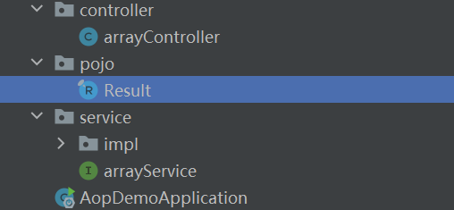
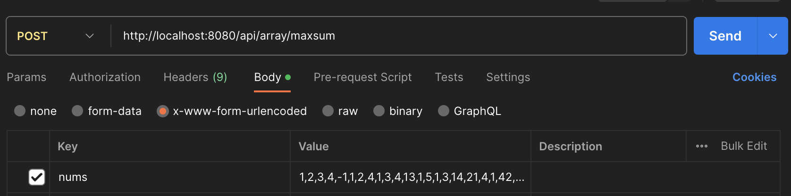
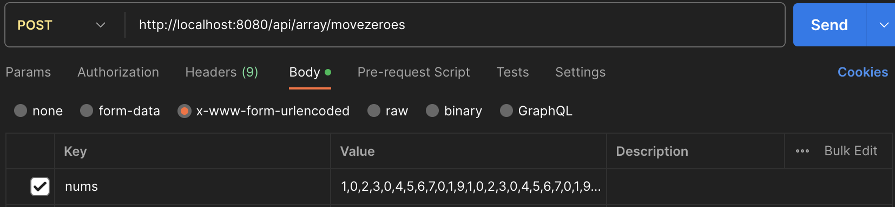
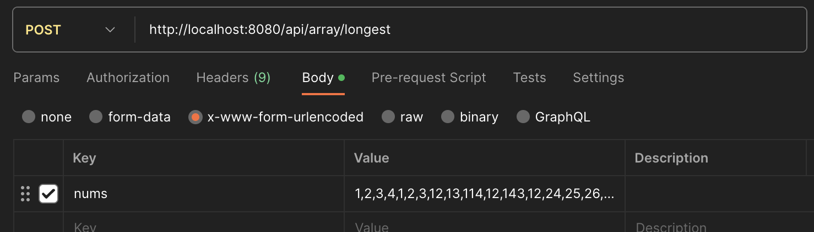
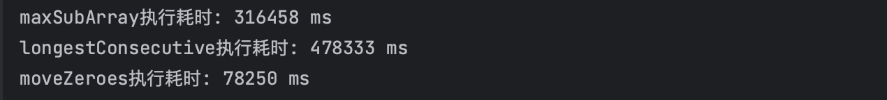
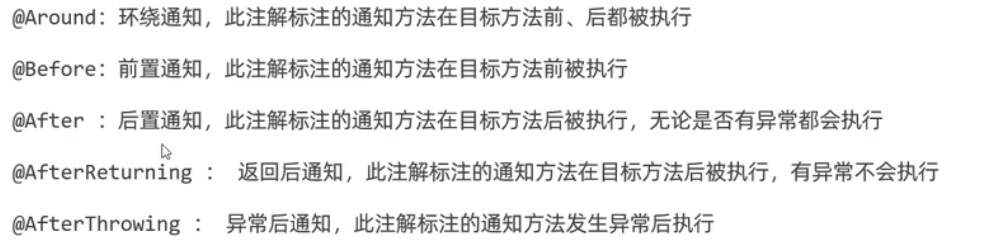
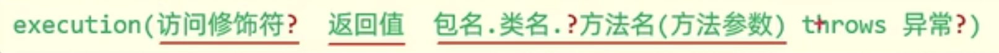
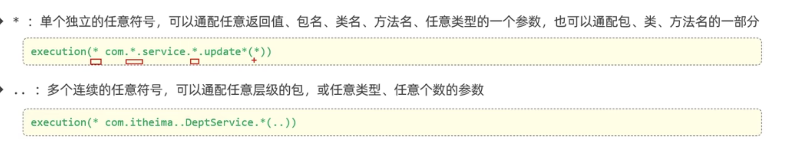

# 概述
面向切面编程，面向方向编程，面向特定方法编程
对一系列方法开发公共代码

# 快速入门
测试一系列方法的用时

## 核心概念

* 连接点： 被AOP控制的方法
* 通知：重复使用的功能，体现为一个方法
* 切入点： 匹配连接点的条件
* 切面：通知加切入点（描述通知和切入点的对应关系）
* 目标对象：通知所应用的对象

## 引入依赖
```xml
<!-- aop切面 -->
<dependency>
    <groupId>org.springframework.boot</groupId>
    <artifactId>spring-boot-starter-aop</artifactId>
    <version>3.1.2</version>
</dependency>
```
## 准备工作
随便引入几个待测方法
```java
//求数组中最大子数组和
public int maxSubArray(int[] nums) {
    int max = nums[0];
    int pre = nums[0];
    for (int i = 1; i < nums.length; i++) {
        if (pre < 0) {
            pre = nums[i];
        }else {
            pre += nums[i];
        }

        if (max < pre) { 
            max = pre;
        }
    }
    return max;
}
```

```java
//求nums中最长连续子数组的长度
public  int longestConsecutive(int[] nums) {
    if(nums.length == 0) return 0;
    Arrays.sort(nums);
    HashMap<Integer, Integer> hashMap = new HashMap<>();
    for (int num : nums) {
        if (hashMap.containsKey(num)) continue;
        if (!hashMap.containsKey(num-1)) hashMap.put(num,1);
        else hashMap.put(num,hashMap.get(num-1) + 1);
    }
    List<Integer> counts = new ArrayList(hashMap.values());
    int max = Collections.max(counts);
    return max;
}
```

```java
//把数组中的0全部移到末尾
public void moveZeroes(int[] nums) {
    int j = 0;
    for (int i = 0; i < nums.length ; i++) {
        if (nums[i] != 0){
            nums[j++] = nums[i];    //注意这里是先把nums[i]的值赋给nums[j],然后j++
        }
    }
    for (int k = j; k < nums.length; k++){
        nums[k] = 0;
    }
}
```

引入一个结果封装类Result
```java
public record Result(
        Integer code,//1 成功 , 0 失败
        String msg, //提示信息
        Object data //数据 data
) {
    public static Result success(Object data) {
        return new Result(1, "success", data);
    }

    public static Result success() {
        return new Result(1, "success", null);
    }

    public static Result error(String msg) {
        return new Result(0, msg, null);
    }
}
```
编写好对应的service和controller  

```java
public class arrayController {
    @Autowired
    private arrayService arrayService;

    @PostMapping("/maxsum")
    public Result maxSum(@RequestParam int[] nums){
        int tmp = arrayService.maxSubArray(nums);
        return Result.success(tmp);
    }

    @PostMapping("/longest")
    public Result longest(@RequestParam int[] nums){
        int tmp = arrayService.longestConsecutive(nums);
        return Result.success(tmp);
    }

    @PostMapping("/movezeroes")
    public Result movezeroes(@RequestParam int[] nums){
        arrayService.moveZeroes(nums);
        return Result.success(nums);
    }
}
```
## 编写aop程序
目标：计算不同方法的执行耗时
添加注释```@Aspect```创建aop类，然后编写模板方法  
当调用目标对象时，会运行基于目标对象生成的代理对象

```java
@Component
@Aspect
public class TimeAspect {
    @Around("execution(* com.example.aopdemo.service.impl.arrayServiceImpl.*(..))")
    public Object recordTime(ProceedingJoinPoint joinPoint) throws Throwable {
        long begin = System.nanoTime();
        Object result = joinPoint.proceed();
        long end = System.nanoTime();
        System.out.println(joinPoint.getSignature() + "执行耗时: " + (end - begin) + " ms");
        return result;
    }
}
```

## 测试
用postman测试接口



结果如下：


# 通知类型


此外还有一个切入点方法
```java
@PointCut("execution(* com.example.aopdemo.service.impl.arrayServiceImpl.*(..))")
private void pc() {}
```
这样就可以在一个类其他方法中直接引用
```java
@Before("pt()")
public Object recordTime(ProceedingJoinPoint joinPoint) throws Throwable{
    log.info("...");
}
```
但如果要在不同类中引用，需要改为public

# 通知的执行顺序
如果不加注解，那么通知前方法字母靠前的先执行，通知后方法字母靠后的先执行

但是可以加注解```@Order(数字)```来控制先后顺序，通知前方法数组越小先执行，通知后方法相反

# 切入点表达式
## execution

?代表可以省略部分  



## annotation
用于匹配有特定注解的方法
首先创建一个自定义注解类
Target表示目标类型，Retention表示注解的生命周期
```java
@Retention(RetentionPolicy.RUNTIME)
@Target(ElementType.METHOD)
public @interface Mytest {
}
```
给目标方法添加注解，然后给切面方法添加@annotation
```java
@Before("@annotation(com.example.aopdemo.AOP.Mytest)")
public void start(JoinPoint joinPoint) {
    System.out.println(joinPoint.getSignature().getName() + "开始执行");
}
```

# 连接点
spring用Joinpoint来抽象连接点
