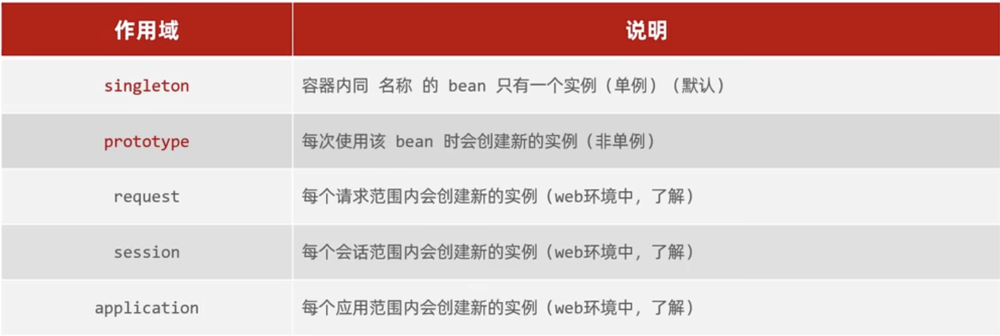

# 认识Bean对象
bean是一个由Spring ioc容器实例化、组装和管理的对象。  
你可以把bean对象视为一个常用的工具。为了方便管理、减少每次创建所需要的时间，统一交给一个容器进行管理。
# 创建Bean对象
使用注解：@Component、@Service、@Controller、@RestController(SpringBoot中)
# 主动获取Bean对象
getBean(Bean的名称,Bean的类型)，可以省略其中一个
# 延迟创建
使用@Lazy可以Bean对象被使用时才创建
如果需要全局使用延迟创建，可以在启动类上添加设置
```java
@Lazy
@SpringBootApplication
public class AopDemoApplication {

    public static void main(String[] args) {
        /*
        SpringApplication.run(AopDemoApplication.class, args);
         */
        SpringApplication Sa = new SpringApplication(AopDemoApplication.class);
        Sa.setLazyInitialization(true);
        Sa.run(args);

    }

}

```
# Bean对象的作用域
通过注解@Scope("作用域")设置

在没有特别标注延迟创建Bean对象的情况下，作用域singleton会在项目启动时创建Bean对象，而prototype会在每次使用时创建。

# 第三方Bean设置
第三方Bean不能使用@Component等等注解，
最简单的方法是在启动类中定义一个方法，添加@Bean注解
```java 
@Bean
public 类名 方法名() {
  return new 类构造器;
}
```
但是为了管理，最好的方法是创建一个配置类
```java
@Configuration
public class CommonConfig {
  @Bean
  public 类名 方法名() {
    return new 类构造器; 
  }
}
```