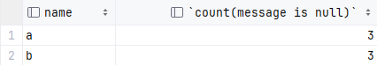
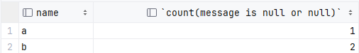

```sql
create table testCount (
    name varchar(20) not null ,
    message varchar(20)
);
insert into testCount values ('a', null), ('a','12'), ('a','1'), ('b','12'), ('b',null), ('b',null);
```
对于这样一个表想要查询不同name下描述信息为空的条数
如果查询如下
```sql
select name,count(message is null) from testCount group by name;
```
结果：  a的所有数据都计数了


但如果查询如下：
```sql
select name,count(message is null or null) from testCount group by name;
```
结果：成功  

count()对于非null内容都做计数，message如果非null，is null返回false同样计数
> count(*)会统计所有包括null