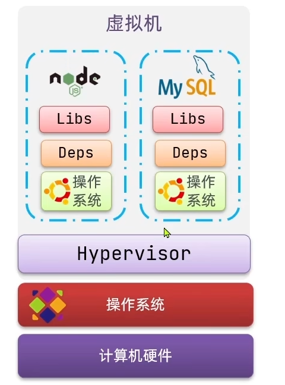
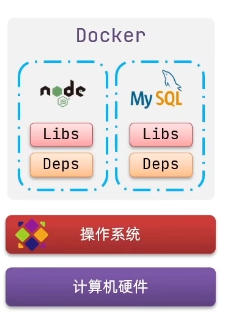

> docker是一个cs架构程序
# 一、原理
|虚拟机|Docker|
|---|---|
|  |  |
| 性能好 | 差 |
| 硬盘占用MB| GB |
| 启动秒级 | 分钟级 |

# 二、概念
* 镜像：应用程序 +  依赖 + 函数库 + 环境...打包
* 容器：应用程序运行形成的进程
* 数据卷：是一个虚拟目录，指向宿主机文件系统中的某个目录（容器可以通过挂载数据卷，来实现在容器外部操控共享数据）

# 三、命令

## 1、镜像命令
| 命令 | 作用 | 例子 |
|--|--|--|
| docker push | 拉取 |
| docker pull | 推送 |
| docker save | 保存镜像压缩包 | ```docker save -o nginx.tar nginx:latest``` |
| docker load | 加载压缩包 |```docker load -i nginx.tar``` |
| docker build | 构建镜像 |
| docker images | 查看 |
| docker rmi  | 删除 |

## 2、 容器命令

| 命令 | 作用 | 例子 |
|--|--|--|
| docker run | 运行镜像 | ```docker run --name nginx -p 80:80 -d nginx``` |
| docker pose | 暂停 |
| docker unpose | |
| docker stop | 停止 |
| docker start | 运行容器 |
| docker rm | 删除容器 |
| docker ps | 查看所有运行的容器 |
| docker logs | 容器运行日志 |
| docker exec | 进入容器执行命令 |

## 3、数据卷命令

| 命令 | 作用 | 例子 |
|--|--|--|
| docker volume create |
| docker volume inspect | 显示数据卷信息 |
| docker volume ls | 列出所有数据卷 |
| docker volume prune | 删除未使用的volume |
| docker volume rm | 删除指定volume |

> 通过```docker run -v 宿主:容器```挂载
> 可以基于数据卷挂载，当然也可以直接目录/文件挂载

# 四、自定义镜像

## 1、镜像结构

* 入口：镜像运行入口（启动脚本、参数）
* 层：安装包、依赖、配置
* 基础镜像：系统函数库、环境、配置

## 2、构建镜像（Dockerfile）
```
FROM openjdk:21
COPY ./target/hotel-demo-0.0.1-SNAPSHOT.jar .
ENTRYPOINT ["java", "-jar", "hotel-demo-0.0.1-SNAPSHOT.jar"] 
```

# 五、DockerCompose

```docker-compose up-d```部署
```
version: '3'
services:
  web:
    build: .
    ports:
   - "5000:5000"
    volumes:
   - .:/code
    - logvolume01:/var/log
    links:
   - redis
  redis:
    image: redis
  demo:
    build:./demo    //自己项目模块的部署./demo中有dockerfile，及模块jar包
volumes:
  logvolume01: {}
```

# 六、私有镜像仓库
 
 阿里云容器镜像服务
