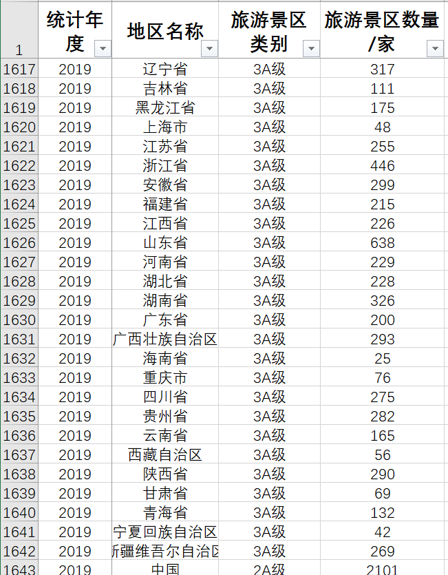
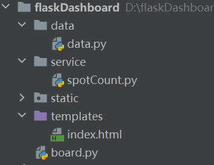
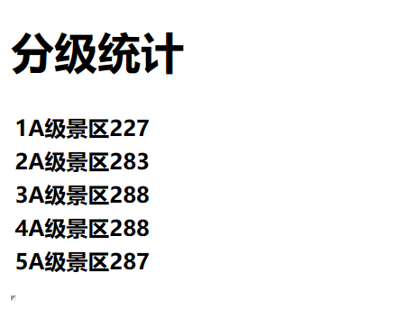

目标：通过使用flask框架实现对全国不用级别景区个数可视化统计

# 数据



[点击获取.xlsx文件](flask入门使用/各省旅游景区数A级景区数.xlsx)

# 项目目录

> static存放静态文件；templates存放html文件；board.py启动网页服务；data获取数据


# 第一步：将表格数据存入数据库
## 将xlsx文件另存为csv

## 如果是存入本地数据库
终端：
```
mysql -u root -p --local-infile
```
> 注意要加后缀，否则出现数据库获取本地数据权限不够的问题

```sql
load data local infile 'C:/Users/shouw/Desktop/各省旅游景区数A级景区数.csv' into table tour.spot_with_rank(year,local,level,num);
```

# 第二步：python连接数据库获取各级别景区数据
在service中创建一个spotCount.py
```python
import pymysql

def dataSE():
    # 数据库连接
    conn = pymysql.connect(
        host='127.0.0.1',
        user='root',
        password='1234',
        port=3306,
        database='tour')
    cursor = conn.cursor()

    sql1 = "select * from spot_with_rank where level = %s"
    leList = ["1A级", "2A级", "3A级", "4A级", "5A级"]
    num = []
    for le in leList:
        cursor.execute(sql1, le)
        num.append(len(cursor.fetchall()))

    return num
```

# 第三步：对数据封装
在data中创建data.py
```python
def chart():
    num = dataSE()
    tmp = {
        'title': '分级统计',
        'data': [
            '1A级景区'+ str(num[0]),
            '2A级景区' + str(num[1]),
            '3A级景区' + str(num[2]),
            '4A级景区' + str(num[3]),
            '5A级景区' + str(num[4]),
        ]}
    echart = {
        'title': tmp.get('title'),
        'A1': tmp.get('data')[0],
        'A2': tmp.get('data')[1],
        'A3': tmp.get('data')[2],
        'A4': tmp.get('data')[3],
        'A5': tmp.get('data')[4]
    }
    return echart
```

# 第四步：html页面
在templates中新建index.html
```html
<!DOCTYPE html>
<html lang="en">
<head>
    <meta charset="UTF-8">
    <title>景点级别统计</title>
</head>
<body>
    <h1>{{ title }}</h1>
    <table>
         <tr>
             <th>{{A1}}</th>
         </tr>
         <tr>
             <th>{{A2}}</th>
         </tr>
        <tr>
             <th>{{A3}}</th>
         </tr>
        <tr>
             <th>{{A4}}</th>
         </tr>
        <tr>
             <th>{{A5}}</th>
         </tr>
    </table>
</body>
</html>
```

# 第五步：falsk服务
创建board.py
```python
from flask import Flask, render_template

from data.data import chart
from service.spotCount import dataSE


# 创建一个flask服务
app = Flask(__name__)


@app.route('/')
def index():
    context = chart()
    return render_template('index.html', **context)


if __name__ == '__main__':
    app.run('127.0.0.1', 4005)
```

# 运行结果
