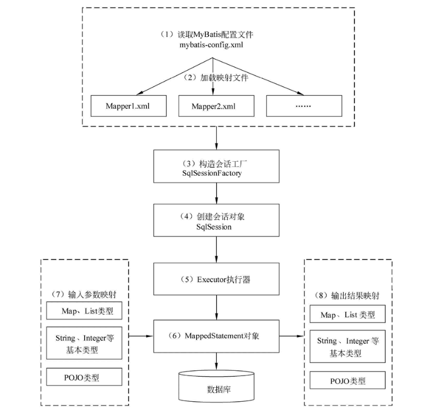
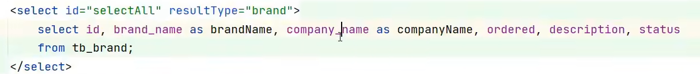
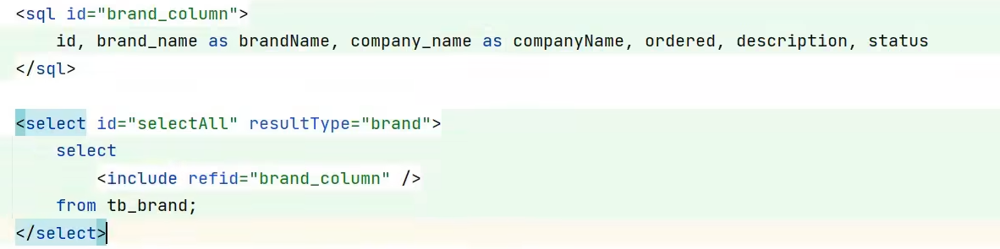
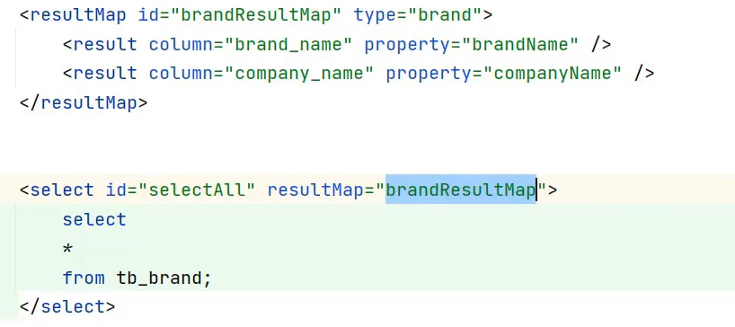
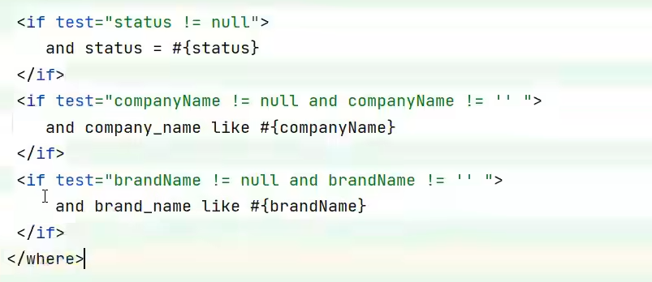
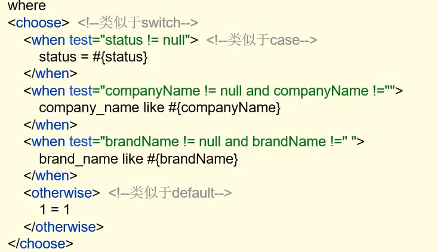
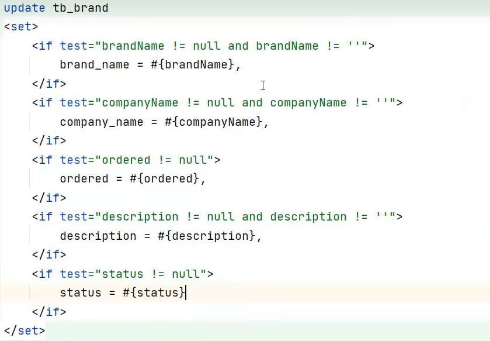
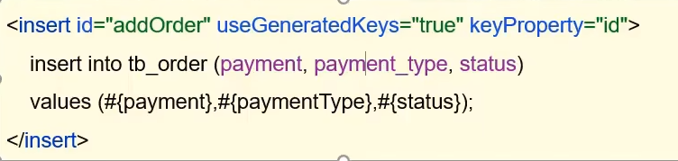

# 一、简介

* 数据持久层框架
* 封装了通过JDBC访问数据库的操作
* 主要思想是将程序中的大量SQL语句剥离出来，配置在配置文件当中，实现SQL的灵活配置
* 好处是将SQL与程序代码分离，可以在不修改代码的情况下，直接在配置文件当中修改SQL。
* 半自动ORM映射工具（mybatis-plus是全自动）
  
# 二、mybatis工作原理

## 1、四大核心对象

### （1）SqlSession

包含了执行SQL语句的所有方法。类似于JDBC里面的Connection

> 注意：虽然其包含了执行SQL语句的所有方法，但其还有getMapper方法来获取mapper接口的代理对象。所以它是委托Executor执行sql的。

### （2）Executor接口

根据SqlSession传递的参数动态地生成需要执行的SQL语句，同时负责查询缓存的维护

### （3）MappedStatement

对映射SQL的封装，用于存储要映射的SQL语句的id、参数等信息。在Executor接口的执行方法中就有一个MappedStatement类型的参数。

### （4）ResultHandler

用于对返回的结果进行处理，最终得到自己想要的数据格式或类型。可以自定义返回类型

## 2、工作流程


## 3、缓存机制
### （1）一级缓存

sqlSession级别的缓存（默认开启）。  
同一个SqlSession，同一sql和参数的情况下，调用同一个方法，只会执行一次sql。

### （2）二级缓存

mapper级别缓存。
可以在各个SqlSession间共享缓存
二级缓存要求返回的POJO必须是可序列化的，即要求实现Serializable接口。
当开启二级缓存后，数据的查询执行的流程就是 二级缓存 -> 一级缓存 -> 数据库。
```xml
<settings>
    <setting name="cacheEnabled" value="true"/>
</settings>
```
在mapper.xml中使用```<cache/>```开启指定mapper的缓存

## 4、实际使用范例

### （1）配置
* mybatis-config.xml 配置数据库连接和mapper

[参考官方文档](https://mybatis.org/mybatis-3/zh/getting-started.html)
### （2）编码

```xml
<mapper namespace="test">
    <select id="selectAll" resultType="org.example.pojo.User">
        select * from User;
    </select>
</mapper>
```
```java
String resource = "mybatis-config.xml";
InputStream inputStream = Resources.getResourceAsStream(resource);
SqlSessionFactory sqlSessionFactory = new SqlSessionFactoryBuilder().build(inputStream);

SqlSession sqlSession = sqlSessionFactory.openSession();

List<User> users = sqlSession.selectList("test.selectAll");

System.out.println(users);

sqlSession.close();
```

# 三、mybatis-config.xml
```xml
<?xml version="1.0" encoding="UTF-8" ?>
<!DOCTYPE configuration
        PUBLIC "-//mybatis.org//DTD Config 3.0//EN"
        "https://mybatis.org/dtd/mybatis-3-config.dtd">
<configuration>
    <!--类型别名(使用后mapper的返回类型默认为类名)-->
    <typeAliases>
        <package name="org.example.pojo"/>
    </typeAliases>
    <environments default="development">
        <!--可以配置多个环境，通过default切换-->
        <environment id="development">
            <transactionManager type="JDBC"/>
            <dataSource type="POOLED">
                <!--数据库连接信息-->
                <property name="driver" value="com.mysql.cj.jdbc.Driver"/>
                <property name="url" value="jdbc:mysql://47.109.104.142:53306/mybatisDemo"/>
                <property name="username" value="root"/>
                <property name="password" value="930516"/>
            </dataSource>
        </environment>
    </environments>
    <mappers>
        <mapper resource="org/example/mapper/testMapper.xml"/>
    </mappers>
</configuration>
```

# 四、Mapper代理开发

### 1、结果封装
> 查询结果如果要封装成对象属性，那么名称要一样，否则不能自动封装
>
> 解决方法：
> > 取别名
> 
> 避免每次取别名
> 
>
> > resultMap（id：主键映射；result：一般字段映射）
> 

### 2、传入参数
 #{}和${}

 #{} 被解析成预编译语句，预编译之后可以直接执行，不需要重新编译sql。

 ${}仅仅为一个字符串替换，每次执行sql之前需要进行编译，存在 sql 注入问题。

#### （1）预编译
mybatis是通过 PreparedStatement 和占位符来实现预编译的。

mybatis底层使用 PreparedStatement ，默认情况下，将对所有的sql进行预编译，将#{}替换为?，然 后将带有占位符?的sql模板发送至mysql服务器，由服务器对此无参数的sql进行编译后，将编译结果缓存，然后直接执行带有真实参数的sql。

把一个 sql 预编译后产生的 PreparedStatement 对象缓存下来， 下次对于同一个sql，可以直接使用这个缓存的 PreparedState 对象。

#### （2）传参方式

* 散装参数


* 实体类


* map  

```Map<String, Object> map ```

> 注意：传入多个参数时，List、Array、Collection都封装为map并且对应两个key：param，arg。可以使用@param修改param键名


### 3、特殊符号
* 使用 CDATA区
```xml
<select id="selectGender" resultMap="userMap">
        select * from User where gender
        <![CDATA[
            >
        ]]>
        #{gender}
</select>
```
* 转义字符
```
<	 &lt;        小于号 
>    &gt;        大于号  
&    &amp;       和  
'    &apos;      单引号  
"    &quot;      双引号  
```
### 4、动态SQL
#### （1）if标签


#### （2）choose标签


#### （3）set标签（where类似  吗）


#### （4）foreach标签
```xml
 <!--对于数组参数，mybatis会将其封装成map，key=array（可以通过@param指定key的名称），value=数组-->
    <delete id="deleteByIds">
        delete from User where id
        in
            <foreach collection="array" item="id" separator="," open="(" close=")">
                #{id}
            </foreach>;
    </delete>
```

### 5、添加操作的主键返回



# 五、注解开发
```
@Select

@Insert

@Update

@Delete
```

# 六、基于SpringBoot使用Mybatis
* 数据库连接配置到application.yaml中
```yaml
spring:
  datasource:
    url: jdbc:mysql://****:****/hotel?useSSL=true
    username: root
    password:  ****
    driver-class-name: com.mysql.cj.jdbc.Driver
```

* 使用```@Mapper```注解标注mapper接口类。运行时自动生成其实现类对象并交给IOC容器
