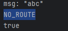

# 一、概念
|概念|解释|
|--|--|
|message|由消息头和消息体组成，消息头由一些可选属性组成|
|publisher|消息生产者|
|Exchange|路由。默认直连交换机，名字为空字符，绑定路由键名称与队列名称相同|
|Binding|将Exchange和queue关联|
|Queue|队列|
|virtual host|默认vhost为/。本质上是一个mini的rmq服务器，对queue、exchange等逻辑分组|
|broker|服务器实体|
|channel|操控mq的工具|

# 二、使用

## 1、AMQP与Spring AMQP

* amqp是传递业务消息的协议
* spring amqp是基于amqp定义出的一套api规范，提供模板来收发消息。其中spring-amqp是基础抽象，spring-rabbit是底层实现

使用准备
```yaml
spring:
  rabbitmq:
    host: ********
    port: 5672
    virtual-host: /
    username: user
    password: 1234
```

```xml
<dependency>
    <groupId>org.springframework.boot</groupId>
    <artifactId>spring-boot-starter-amqp</artifactId>
</dependency>
```
## 2、基础消息队列
由一个生产者、一个队列、一个消费者组成
```java
    //生产者
    @Autowired
    private RabbitTemplate rabbitTemplate;

    public void simpleQueue(String message, String queueName) {
        rabbitTemplate.convertAndSend(queueName,message);
    }
```
```java
    //消费者
    @RabbitListener(queues = "simple.queue")
    public void listenSimpleQueue(String message) {
        System.out.println(message);
    }
```
## 3、工作消息队列
由一个生产者、一个队列、多个消费者组成  
当队列中有多个消息时，消费者会预抓取（假如有50个消息待处理，那么两个消费者会轮流抓取）。但未来让消费者根据能力抓取，可以设置如下
```yaml
//每次只预抓取1个消息，处理后再抓
spring:
  rabbitmq:
    listener:
      simple:
        prefetch: 1
```

```java
    //生产者
    @RabbitListener(queues = "work.queue")
    public void listenWorkQueue1(String message) throws InterruptedException {
        System.out.println("1:" + message);
        Thread.sleep(20);
    }
```

```java
    //消费者
    @RabbitListener(queues = "work.queue")
    public void listenWorkQueue1(String message) throws InterruptedException {
        System.out.println("1:" + message);
        Thread.sleep(20);
    }

    @RabbitListener(queues = "work.queue")
    public void listenWorkQueue2(String message) throws InterruptedException {
        System.out.println("2:" + message);
        Thread.sleep(200);
    }
```

## 4、发布订阅
### （1）广播（Fanout Exchange）
每个消息都会路由到所有队列中
一个生产者、一个交换机、多个队列、对应消费者

```java
//创建交换机、队列，并绑定
@Configuration
public class FanoutConfig {
    @Bean
    public FanoutExchange fanoutExchange(){
        return new FanoutExchange("demo.fanout");
    }

    @Bean
    public Queue fanoutQueue1(){
        return new Queue("fanout.queue1");
    }

    @Bean
    public Binding bindingQueue1(Queue fanoutQueue1, FanoutExchange fanoutExchange){
        return BindingBuilder.bind(fanoutQueue1).to(fanoutExchange);
    }

    @Bean
    public Queue fanoutQueue2(){
        return new Queue("fanout.queue2");
    }

    @Bean
    public Binding bindingQueue2(Queue fanoutQueue2, FanoutExchange fanoutExchange){
        return BindingBuilder.bind(fanoutQueue2).to(fanoutExchange);
    }
}
```

```java
//生产者
 public void fanoutQueue(String message, String exchangeName) throws InterruptedException {
        rabbitTemplate.convertAndSend(exchangeName,"", message);
    }
```

```java
//消费者
    @RabbitListener(queues = "fanout.queue1")
    public void listenFanoutQueue1(String message) throws InterruptedException {
        System.out.println("FanoutQueue1:" + message);
        Thread.sleep(20);
    }

    @RabbitListener(queues = "fanout.queue2")
    public void listenFanoutQueue2(String message) throws InterruptedException {
        System.out.println("FanoutQueue2:" + message);
        Thread.sleep(20);
    }
```

### （2）路由（Direct Exchange）
RoutingKey:列表，用于绑定交换机和队列

```java
    //生产者
    public void directQueue(String message, String key, String exchangeName) throws InterruptedException {
        rabbitTemplate.convertAndSend(exchangeName,key, message);
    }
```

```java
    //消费者
    @RabbitListener(bindings = @QueueBinding(
            value = @Queue("direct.queue1"),
            exchange = @Exchange(value = "demo.direct" ,type = ExchangeTypes.DIRECT),
            key = {"normal"}
    ))
    public void listenDirectQueue1(String message) throws InterruptedException {
        System.out.println("DirectQueue1:" + message);
        Thread.sleep(20);
    }

    @RabbitListener(bindings = @QueueBinding(
            value = @Queue("direct.queue2"),
            exchange = @Exchange(value = "demo.direct",type = ExchangeTypes.DIRECT),
            key = {"special"}
    ))
    public void listenDirectQueue2(String message) throws InterruptedException {
        System.out.println("DirectQueue2:" + message);
        Thread.sleep(20);
    }
```
### （3）主题（Topic Exchange）
BindingKey以.分割，可以使用通配符(#:0个或多个单词；*：一个单词)
``` java
    //生产者
    public void topicQueue(String message, String key, String exchangeName) throws InterruptedException {
        rabbitTemplate.convertAndSend(exchangeName,key, message);
    }
```


```java
    //消费者
    @RabbitListener(bindings = @QueueBinding(
            value = @Queue("topic.queue1"),
            exchange = @Exchange(value = "demo.topic", type = ExchangeTypes.TOPIC),
            key = {"China.#"}
    ))
    public void listenTopicQueue1(String message) throws InterruptedException {
        System.out.println("China:" + message);
        Thread.sleep(20);
    }

    @RabbitListener(bindings = @QueueBinding(
            value = @Queue("topic.queue2"),
            exchange = @Exchange(value = "demo.topic", type = ExchangeTypes.TOPIC),
            key = {"Japan.#"}
    ))
    public void listenTopicQueue2(String message) throws InterruptedException {
        System.out.println("Japan:" + message);
        Thread.sleep(20);
    }   
```

### （4）headers
根据发送的消息内容中的headers属性进行路由的。在绑定Queue与Exchange时指定一组键值对
# 三、消息转换器
SpringAMQP将消息序列化后发送，并且是由MessageConverter处理，其默认实现为SimpleMessageConverrter,基于jdk的ObjectOutputAStream完成序列化

但可以使用json序列化减小长度


消费者生产者都需要：
```xml
    <dependency>
        <groupId>com.fasterxml.jackson.core</groupId>
        <artifactId>jackson-databind</artifactId>
    </dependency>
```

```java
    @Bean
    public MessageConverter messageConverter() {
        return new Jackson2JsonMessageConverter();
    }
```
# 四、消息丢失

消息丢失可能有三种原因：  
* 生产到rmq途中
* 路由不可达
* rmq存储时
* 消费者处理时

对应解决方法：  
* 生产者确认机制
* return机制和备份机制
* 持久化
* 消费者手动确认消息

## 1、生产者确认机制

### （1）事务的方法
> 当消息发送后，生产者阻塞，等待回应后继续

### （2）开启生产者确认的方法
```yaml
spring:
    rabbitmq:
        #开启 confirm 确认机制
        publisher-confirm-type: correlated
```

```java
    //定义回调
    rabbitTemplate.setConfirmCallback(new RabbitTemplate.ConfirmCallback() {
        /**
         * @param correlationData convertAndSend相关的配置信息
         * @param b 表示交换机是否成功收到消息
         * @param s 表示失败的原因
         */
        @Override
        public void confirm(CorrelationData correlationData, boolean b, String s) {
            System.out.println(b);
            if (!b) {
                System.out.println(s);
                System.out.println("异常处理！");
            }
        }
    });
    rabbitTemplate.convertAndSend(exchangeName,"", message);

    try {
        Thread.sleep(2000);
    } catch (InterruptedException e) {
        e.printStackTrace();
    }
```
> 值得注意的是springamqp自动实现了与rmq建立连接、创建通道的步骤。如果convertAndSend后直接结束进程，那么channel会关闭，由于ConfirmCallback是异步的，所以哪怕消息成功发送，b也会为false，提示：clean channel shutdown; protocol method: #method<channel.close>(reply-code=200, reply-text=OK, class-id=0, method-id=0)

## 2、return机制和备份机制
### （1）return消息机制
提供了回调函数returnCallback，当消息从交换机到队列失败时才会调用
```yaml
spring:
  rabbitmq:
    template:
      mandatory: true
```

```java
    //定义回调
    rabbitTemplate.setConfirmCallback(new RabbitTemplate.ConfirmCallback() {
        /**
         * @param correlationData convertAndSend相关的配置信息
         * @param b 表示交换机是否成功收到消息
         * @param s 表示失败的原因
         */
        @Override
        public void confirm(CorrelationData correlationData, boolean b, String s) {
            System.out.println(b);
            if (!b) {
                System.out.println(s);
                System.out.println("异常处理！");
            }
        }
    });

    //return消息（路由不可达）
    rabbitTemplate.setReturnsCallback(new RabbitTemplate.ReturnsCallback() {
        @Override
        public void returnedMessage(@NonNull ReturnedMessage returnedMessage) {
            System.out.println("msg: " + new String(returnedMessage.getMessage().getBody()));
            System.out.println(returnedMessage.getReplyText());
        }
    });

    rabbitTemplate.convertAndSend(exchangeName,"", message);

    try {
        Thread.sleep(2000);
    } catch (InterruptedException e) {
        e.printStackTrace();
    }
```
当我们将confirm和return机制都加上，并且由于没有打开消费者，所以交换机上没有绑定队列时，发送消息。由于消息成功到达交换机，所以confirm中b=true;但是由于没有队列绑定所以消息路由失败，提示：NO_ROUTE。



### （2）备份交换机()
备份交换机alternate-exchange是一个普通的exchange，当你发送消息到对应的exchange时，没有匹
配到queue，就会自动转移到备份交换机对应的queue，这样消息就不会丢失。


> 注意的是备份交换机和死信交换机的区别是  
> 死信交换机处理的是被拒绝、过期、溢出的消息；而备份交换机处理的是未被路由的消息
```java
    //交换机，队列，路由名
    public final static String CONFIRM_EXCHANGE="confirm_exchange";
    public final static String CONFIRM_QUEUE="confirm_queue";
    public final static String CONFIRM_ROUTING_KEY="confirm";
 
    //备份队列，交换机,报警队列
    public final static  String BACKUP_EXCHANGE="backup_exchange";
    public final static  String BACKUP_QUEUE="backup_queue";
    public final static  String WARNING_QUEUE="warning_queue";
 
    //声明交普通换机，队列
    @Bean
    public DirectExchange confirmExchange(){
        return ExchangeBuilder.directExchange(CONFIRM_EXCHANGE).durable(true)
                //普通交换机声明其备份交换机
                .withArgument("alternate-exchange",BACKUP_EXCHANGE).build();
    }
    @Bean
    public Queue confirmQueue(){
        return QueueBuilder.durable(CONFIRM_QUEUE).build();
    }
 
    //绑定交换机和队列
    @Bean
    public Binding queueBindExchange(@Qualifier("confirmExchange") DirectExchange exchange,
                                     @Qualifier("confirmQueue") Queue queue){
        return BindingBuilder.bind(queue).to(exchange).with(CONFIRM_ROUTING_KEY);
    }
 
    //备份交换机，备份队列，报警队列声明即绑定
    @Bean
    public FanoutExchange backupExchange(){
        return ExchangeBuilder.fanoutExchange(BACKUP_EXCHANGE).build();
    }
 
    @Bean
    public Queue backupQueue(){
        return QueueBuilder.durable(BACKUP_QUEUE).build();
    }
 
    @Bean
    public Queue warningQueue(){
        return QueueBuilder.durable(WARNING_QUEUE).build();
    }
 
    @Bean
    public Binding backExchangeBindbackQueue(@Qualifier("backupExchange") FanoutExchange fanoutExchange,
                                             @Qualifier("backupQueue") Queue queue){
        return BindingBuilder.bind(queue).to(fanoutExchange);
    }
 
    @Bean
    public Binding warningQueueBindBackQueue(@Qualifier("backupExchange") FanoutExchange exchange,
                                             @Qualifier("warningQueue") Queue queue){
        return BindingBuilder.bind(queue).to(exchange);
    }
```

当然还有注解的方式来绑定

```java
    @RabbitListener(bindings = @QueueBinding(
            value = @Queue("direct.queue2"),
            exchange = @Exchange(value = "demo.direct",type = ExchangeTypes.DIRECT),
            arguments = @Argument(name = "alternate-exchange", value = "direct.alternate"),
            key = {"special"}
    ))
    public void listenDirectQueue2(String message) throws InterruptedException {
        System.out.println("DirectQueue2:" + message);
        Thread.sleep(20);
    }
```

## 3、持久化
条件：
* queue持久化
* Exchange持久化
```java
    @RabbitListener(bindings = @QueueBinding(
            value = @Queue(value = "direct.queue1", durable = "true"),
            exchange = @Exchange(value = "demo.direct" ,type = ExchangeTypes.DIRECT, durable = "true"),
            key = {"normal"}
    ))
```
* 消息设置持久化
> 使用convertAndSend发送消息，默认就是持久化的


## 4、消费者手动确认消息
> 默认情况下，消费者自动确认消息 ,MQ收到后就会移除这一消息
> 但是更稳妥的做法是采用手动确认，等消费者完成逻辑处理后再手动ack。
```yaml
spring.rabbitmq.listener.simple.acknowledge-mode=manual
```

```java
    @RabbitListener(queues = "simple.queue")
    public void listenSimpleQueue(Message message, Channel channel) throws IOException {
        long deliveryTag = message.getMessageProperties().getDeliveryTag();
        try {
            System.out.println("处理消息");
            System.out.println(new String(message.getBody()));
            //手动ack(true:确认所有消息，false:只确认当前消息)
            channel.basicAck(deliveryTag, false);
            Thread.sleep(5000);
        } catch (InterruptedException e) {
            //b:ack返回false；b1:是否重新返回队列
            channel.basicNack(deliveryTag, false, true);
            e.printStackTrace();
        }
    }
```

# 五、死信队列
消费失败消息存放的队列（被拒绝、过期、溢出的消息）
```java
    @RabbitListener(bindings = @QueueBinding(
            value = @Queue("direct.queue2"),
            exchange = @Exchange(value = "demo.direct",type = ExchangeTypes.DIRECT),
            arguments = @Argument(name = "x-dead-letter-exchange", value = "direct.dead"),
            key = {"special"}
    ))
    public void listenDirectQueue2(String message) throws InterruptedException {
        System.out.println("DirectQueue2:" + message);
        Thread.sleep(20);
    }
```
# 六、如何保障消息的顺序性
* 单线程
* 编号
