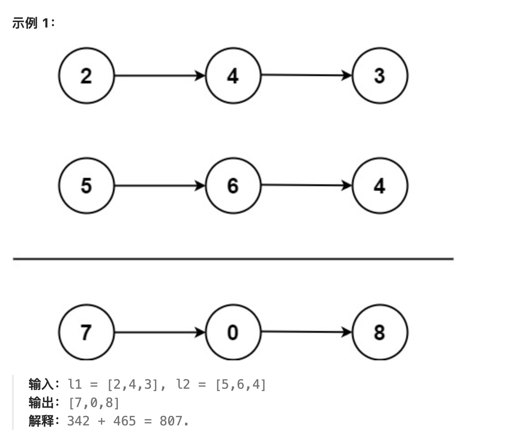

# 题目

给你两个 非空 的链表，表示两个非负的整数。它们每位数字都是按照 逆序 的方式存储的，并且每个节点只能存储 一位 数字。  

请你将两个数相加，并以相同形式返回一个表示和的链表。  

你可以假设除了数字 0 之外，这两个数都不会以 0 开头。  
  

# 分析
我们当然可以按照加法思路去计算  
为了使代码更加简洁，采用迭代的方法，每次返回list1，如果最左侧有进位，在左侧新加节点。

# 题解
```java
/**
 * Definition for singly-linked list.
 * public class ListNode {
 *     int val;
 *     ListNode next;
 *     ListNode() {}
 *     ListNode(int val) { this.val = val; }
 *     ListNode(int val, ListNode next) { this.val = val; this.next = next; }
 * }
 */
class Solution {
    public ListNode addTwoNumbers(ListNode l1, ListNode l2) {
        if (l1 == null) return l2;
        if (l2 == null) l2 = new ListNode(0);
        int curr = l1.val + l2.val;
        if (curr < 10) {
            l1.val = curr;
        } else if(l1.next == null) {
            l1.val = curr - 10;
            l1.next = new ListNode(1);
        } else {
            l1.val = curr - 10;
            l1.next.val += 1;   // 当l2为空时，之所以要创建一个0节点代替，就是要防止这l1进位过后>10
        }
        l1.next = addTwoNumbers(l1.next,l2.next);
        return l1;
    }
}
```