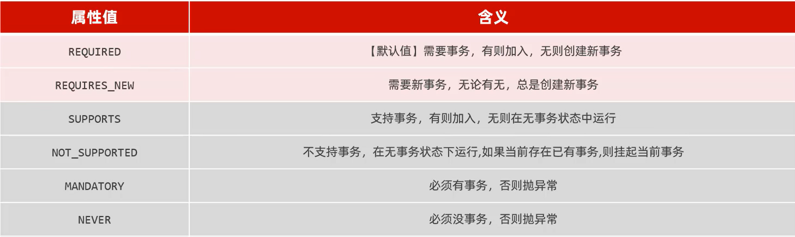

# 快速使用
添加```@Transactional```在service层，将当前事务交给spring管理。方法执行前开启事务；方法执行后关闭事务；出现异常回滚事务。

要注意的是这里的出现异常，回滚事务。默认要求异常类型为RuntimeExceptiom。

如果想要控制回滚异常类型，需要设置rollbackfor属性```@Transactional(rollbackfor = Exception.class)```

另外，如果涉及到了事务方法互相嵌套时，需要用propagation(事务传播属性)来控制嵌套的事务方法如何进行事务控制

