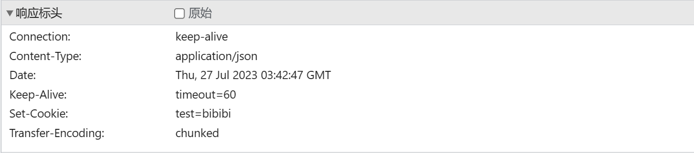
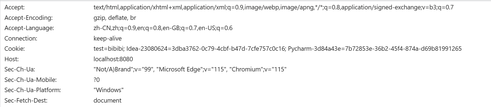
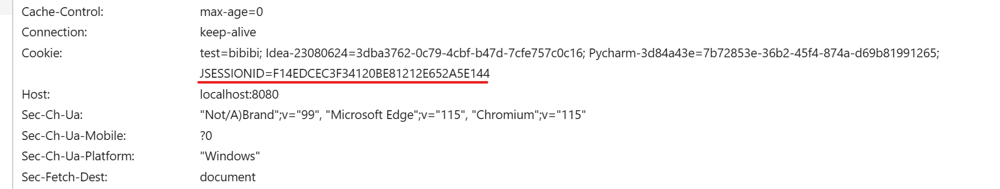
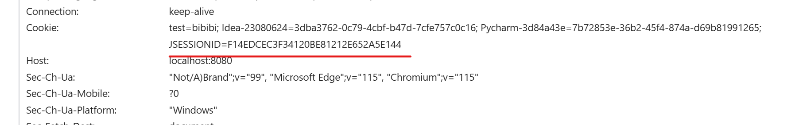
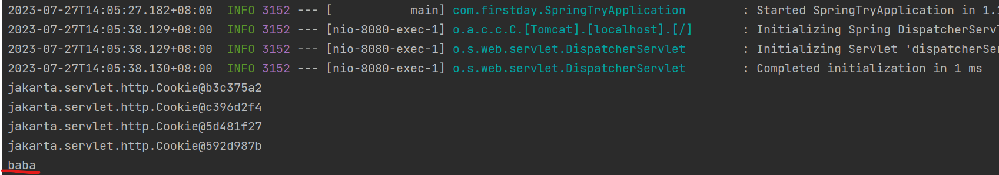
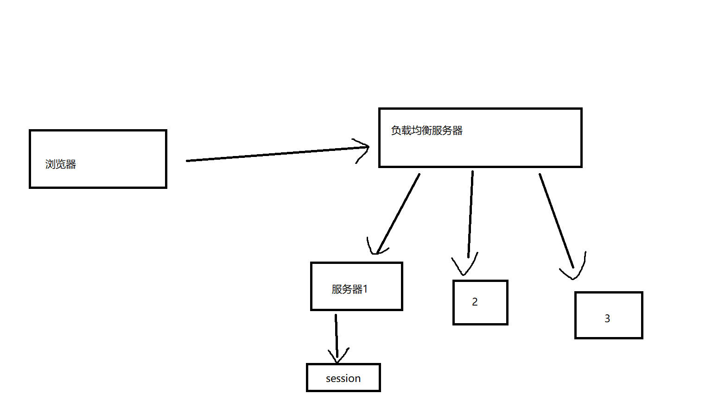

# 会话与会话跟踪
会话：用户通过浏览器持续与服务器建立连接，直到一方断开连接，会话结束。一次会话可以包含多次请求和响应  

会话跟踪：维护浏览器状态的方法。服务器识别多次请求是否来源于同一浏览器，从而在多次请求间共享数据

会话跟踪的技术：cookie，session，令牌

# 会话跟踪技术的简单示例
## Cookie
存储在浏览器中
请求头中包含：**Cookie:xxx**与之前响应包头中：**Set-Cookie:xxx**一致

设置与获取Cookie：分别在HttpServletResponse和HttpServletRequest中
```java
@RestController
public class SessionController {
    // 设置cookie
    @GetMapping("/session/c1")
    public Result addCoookie(HttpServletResponse response) {
        response.addCookie(new Cookie("test", "bibibi"));
        return Result.success();
    }
    //获取cookie
    @GetMapping("/session/c2")
    public Result getCookie(HttpServletRequest request) {
        Cookie[] cookies = request.getCookies();
        for (Cookie cookie : cookies) {
            System.out.println(cookie);
        }
        return Result.success();
    }
}
```
检验：浏览器打开**http://localhost:8080/session/c1**,再打开**http://localhost:8080/session/c2**

可以发现打开c1时响应头中：Set-Cookies

可知，服务器会自动将cookies响应给浏览器

接下来打开c2页面，可以发现Cookies中添加了c1界面响应得到的cookie

可知，浏览器会自动存储cookie，并自动将其添加到请求头中

* 优点：http所支持，可以自动进行
* 缺点：  
    移动端不可用  
    存储于浏览器，不安全  
    不能跨域（前后端必须在同一个域内）
> 跨域的三个维度：协议，ip/域名，端口

## Session
存储在服务器中
```java
    // 设置session
    @GetMapping("/session/s1")
    public Result addSession(HttpSession session) {
       session.setAttribute("abab","baba");
       return Result.success();
    }
    // 获取session
    @GetMapping("/session/s2")
    public Result getSession(HttpSession session) {
        Object value = session.getAttribute("abab");
        System.out.println(value);
        return Result.success();
    }
```
先浏览器访问**http://localhost:8080/session/s1**  
可以发现请求头中多了一个JSESSIONID，代表浏览器对应session会话对象的id

再在浏览器中访问**http://localhost:8080/session/s2**   
可以发现请求头中同样带有该ID

再看下控制台，发现打印了value，获取session内容成功


* 优点：数据存储在服务器端，安全
* 缺点：  
    cookie的缺点（以cookie为底层）  
    服务器集群环境下无法使用

当访问c1时，负载均衡服务器调配到服务器1，并在其上创建session，但是访问s2时，可能访问到服务器2，3。这时候拿不到session对象。

## 令牌（JWT）
通信双方以json格式安全传输数据（可靠性由数字签名保证）。  
在服务器生成后发送存储给浏览器，之后每次请求都携带令牌
### 组成
* header（头）: 记录令牌类型、签名算法
* payload（有效载荷）：携带自定义信息、默认信息等
* signature（签名）
### 使用
#### 引入依赖
```xml
<dependency>
    <groupId>io.jsonwebtoken</groupId>
    <artifactId>jjwt</artifactId>
    <version>0.9.1</version>
</dependency>
```
#### 生成和校验
```java
//生成
public static String creJWT(Map<String, Object> claims, String secret){

    String jwt = Jwts.builder()
            .signWith(SignatureAlgorithm.HS256,secret)//设置签名算法
            .setClaims(claims)
            .setExpiration(new Date(System.currentTimeMillis() + 3600*1000))
            .compact();
    return jwt;
}
//校验
public static Claims parseJWT(String jwt, String secret) {
    Claims claims = Jwts.parser()
            .setSigningKey(secret)
            .parseClaimsJwt(jwt)
            .getBody();
    return claims;
}
```
#### 过程
后端生成jwt令牌在响应数据中返回给前端，前端每次请求都在请求头中携带jwt