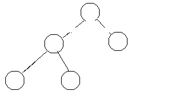
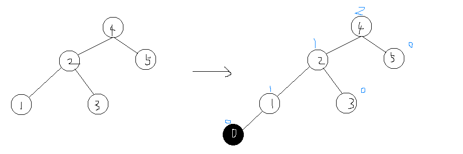
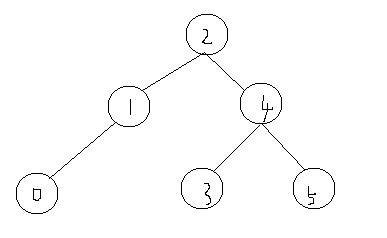
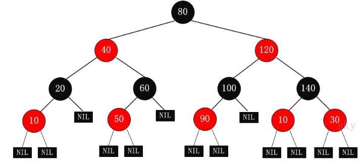

# 完全二叉树

* 只有最下两层结点的度可以小于2
* 最下层的叶结点都集中在左侧

# 二叉查找树（二叉搜索树）
* left < right
* 中序遍历有序
* 容易退化成一条链：查找时间从O(log2(n))->O(n)

  
# 平衡二叉树
* 当节点数目一定，保持树的左右两端保持平衡，树的查找效率最高，可以解决二叉查找树的退化问题
* 可以是空树。假如不是空树，任何一个结点的左子树与右子树都是平衡二叉树，并且高度之差的绝对值不超过 1。

## 例子
左侧为一棵平衡二叉树，加入一个0结点后可以发现4节点平衡因子为2，所以不平衡了。  

从插入结点向上查找，发现的第一个不平衡结点作为根的子树就是<u>最小失衡子树</u>。这个时候我们只需要调整最小失衡子树就可以平衡了（失衡子树哪边高就把哪边向上旋转）。

右旋后：

# 红黑树
## 简介
* AVL的左右子树高度差不能超过1，每次进行插入/删除操作时，几乎都需要通过旋转操作保持平衡。在频繁进行插入/删除的场景中，频繁的旋转操作使得AVL的性能大打折扣

* 红黑树通过牺牲严格的平衡，换取插入/删除时少量的旋转操作（红黑树插入时的不平衡，不超过两次旋转就可以解决；删除时的不平衡，不超过三次旋转就能解决）

* 红黑树的红黑规则，保证最坏的情况下，也能在O(log2(N))时间内完成查找操作。

可以发现红黑树有如下特点（红黑规则）：  
* 节点不是红色就是黑色，根节点是黑色  
* 红黑树的叶子节点并非传统的叶子节点，红黑树的叶子节点是null节点（空节点）且为黑色
* 同一路径，不存在连续的红色节点
* 结点到其所有叶子结点经过的黑色结点数相同（相同黑色高度）

有了上述规则就可以保证红黑树的大致平衡：<U>根到叶子的所有路径中，最长路径不会超过最短路径的2倍</U>
> 假如说黑色高度为3，  
> 那么最短到叶子结点路径：黑-》黑-》黑；最长：黑-》红-》黑-》红-》黑

## 红黑树的实现

