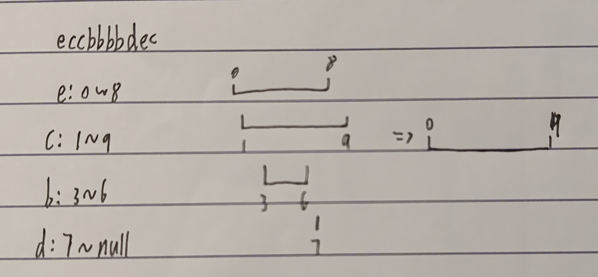

# 题目
给你一个字符串 s 。我们要把这个字符串划分为尽可能多的片段，同一字母最多出现在一个片段中。

注意，划分结果需要满足：将所有划分结果按顺序连接，得到的字符串仍然是 s 。

输入：s = "ababcbacadefegdehijhklij"  
输出：[9,7,8]  
解释：  
划分结果为 "ababcbaca"、"defegde"、"hijhklij"  
# 分析 
最简单的想法就是遍历找出每种字符的开始和结束位置，然后把相重叠的区间融合在一起 。   


但更简单的办法是记录字母最后出现的位置，遍历数组，记录当前片段的开始和结束位置，不断更新该片段的最低到达位置

# 代码
```java
class Solution {
    public List<Integer> partitionLabels(String s) {
        int len = s.length();
        // 利用hash表统计字符的开始结束位置（value的值就是该字符的区间）
        HashMap<Character, Integer[]> map = new HashMap<>();
        for (int i = 0; i < len; i++) {
            char ch = s.charAt(i);
            if (map.containsKey(ch)) {
                Integer[] value = map.get(ch);
                value[1] = i;
                map.put(ch,value);
            } else {
                Integer[] value = new Integer[2];
                value[0] = i;
                map.put(ch, value);
            }
        }
        // 将区间按开始位置从小到大排序
        List<Integer[]> values = map.values().stream().toList();
        List<Integer[]> valuesSorted = values.stream().sorted(new Comparator<Integer[]>() {
            @Override
            public int compare(Integer[] o1, Integer[] o2) {
                return o1[0] - o2[0];
            }
        }).toList();
        // 合并区间
        List<Integer> res = new ArrayList<>();
        int start = 0;
        int end = 0;
        for (Integer[] value: valuesSorted) {

            if (value[0] <= end) {
                if (value[1] == null) continue;
                end = Math.max(value[1], end);
            } else {
                res.add(end - start + 1);
                if (value[1] == null) {
                    start = value[0];
                    end = value[0];
                    continue;
                }
                start = value[0];
                end = value[1];
            }
        }
        res.add(end - start + 1);
        return res;
    }
}
```
```java
class Solution {
    public List<Integer> partitionLabels(String s) {
        int len = s.length();
        int[] last = new int[26];
        // 记录字母出现的最后位置
        for (int i = 0; i < len; i++) {
            last[s.charAt(i) - 'a'] = i;
        }
        List<Integer> res = new ArrayList<>();
        int start = 0, end = 0;
        for (int i = 0; i < len; i++) {
            end = Math.max(end, last[s.charAt(i) - 'a']);
            if (end == i) {
                res.add(end - start + 1);
                start = end + 1;
            }
        }
        return res;
    }
}
```