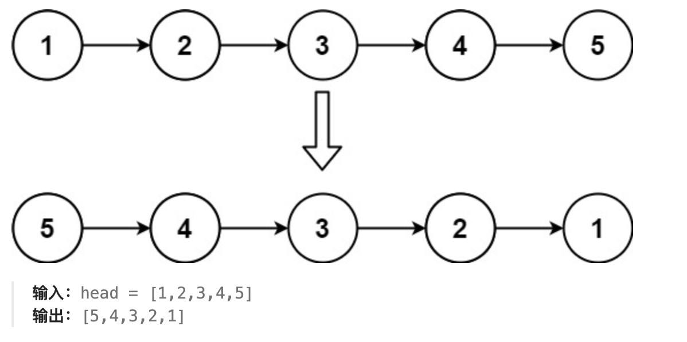
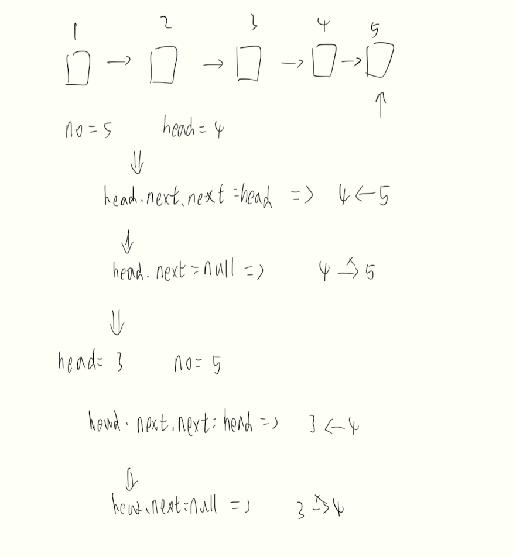

# 题目

给你单链表的头节点 head ，请你反转链表，并返回反转后的链表。


# 分析

由图可以发现只需要把所有的箭头翻转就可以了.如果采用迭代的方法，可以选择从头节点开始依次向右遍历改变箭头;如果选择递归,如图：


# 题解
迭代
```java
/**
 * Definition for singly-linked list.
 * public class ListNode {
 *     int val;
 *     ListNode next;
 *     ListNode() {}
 *     ListNode(int val) { this.val = val; }
 *     ListNode(int val, ListNode next) { this.val = val; this.next = next; }
 * }
 */
class Solution {
    public ListNode reverseList(ListNode head) {
        ListNode pre = null;
        ListNode curr = head;

        while (curr != null) {
            ListNode tmp = curr.next;
            curr.next = pre;
            pre = curr;
            curr = tmp;
        }
        return pre;
    }
}
```

递归
```java
class Solution {
    public ListNode reverseList(ListNode head) {
       if (head == null || head.next == null) {
            return head;
        }

        ListNode no = reverseList(head.next);
        head.next.next = head;
        head.next = null;
        
        return no;
    }
}
```