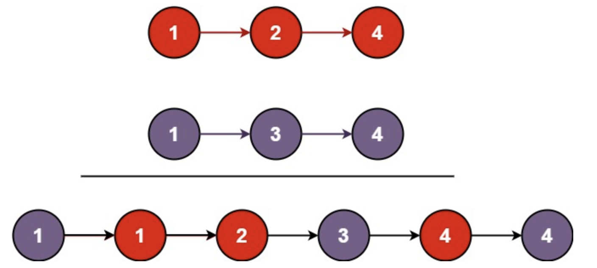

# 题目
将两个升序链表合并为一个新的 升序 链表并返回。新链表是通过拼接给定的两个链表的所有节点组成的  


# 分析
如果采用迭代的方法，那么把List1作为结果返回，把List2的节点插入List1中即可。
如果采用递归

# 题解
```java
/**
 * Definition for singly-linked list.
 * public class ListNode {
 *     int val;
 *     ListNode next;
 *     ListNode() {}
 *     ListNode(int val) { this.val = val; }
 *     ListNode(int val, ListNode next) { this.val = val; this.next = next; }
 * }
 */
class Solution {
    public ListNode mergeTwoLists(ListNode list1, ListNode list2) {
        ListNode pre = null;
        ListNode n1 = list1;
        ListNode n2 = list2;
        if (n1 == null) return list2;
        if (n2 == null) return  list1;
        while (n1 != null && n2 != null) {
            if (n1.val <= n2.val) {
                pre = n1;
                n1 = n1.next;
            } else if (pre == null) {
                list1 = n2;
                ListNode tmp = n2.next;
                pre = n2;
                pre.next = n1;
                n2 = tmp;
            } else {
                ListNode tmp = n2.next;
                pre.next = n2;
                n2.next = n1;
                pre = pre.next;
                n2 = tmp;
            }
        }
        if (n2 != null) {
            pre.next = n2;
        }

        return list1;
    }
}
```

```java
/**
 * Definition for singly-linked list.
 * public class ListNode {
 *     int val;
 *     ListNode next;
 *     ListNode() {}
 *     ListNode(int val) { this.val = val; }
 *     ListNode(int val, ListNode next) { this.val = val; this.next = next; }
 * }
 */
class Solution {
    public ListNode mergeTwoLists(ListNode list1, ListNode list2) {
        if (list1 == null) {
            return list2;
        } else if (list2 == null) {
            return list1;
        } else if (list1.val < list2.val) {
            list1.next = mergeTwoLists(list1.next, list2);
            return list1;
        } else {
            list2.next = mergeTwoLists(list1, list2.next);
            return list2;
        }
    }
}
```