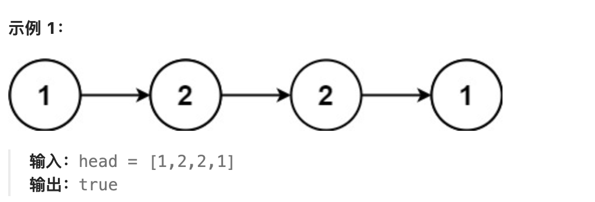
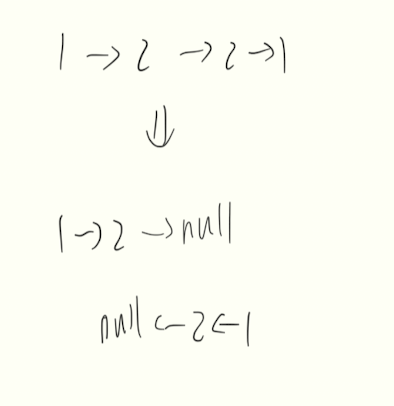

# 题目
给你一个单链表的头节点 head ，请你判断该链表是否为回文链表。如果是，返回 true ；否则，返回 false 。


# 分析

可以使用递归，创建两个指针分别指向开头和结尾  
但在每次递归时，都会创建一个ListNode指向当前节点，所以空间复杂度为O(n)  
想要做到O(1)，我们可以将后半部分链表反转,比较完前半段和后半段后，再复原
  
要找到后半段的开始节点，使用快慢指针分别指向末尾和中点

# 题解
递归
```java
/**
 * Definition for singly-linked list.
 * public class ListNode {
 *     int val;
 *     ListNode next;
 *     ListNode() {}
 *     ListNode(int val) { this.val = val; }
 *     ListNode(int val, ListNode next) { this.val = val; this.next = next; }
 * }
 */
class Solution {
    private static ListNode leftNode;
    public static boolean isPalindrome(ListNode head) {
        leftNode = head;

        return compare(head);
    }

    public static boolean compare(ListNode curr) {
        if (curr != null){
            if (!compare(curr.next)) {
                return false;
            }
            if (curr.val != leftNode.val) {
                return false;
            }
            leftNode = leftNode.next;
        }
        return true;
    }
}
```
快慢指针
```java
/**
 * Definition for singly-linked list.
 * public class ListNode {
 *     int val;
 *     ListNode next;
 *     ListNode() {}
 *     ListNode(int val) { this.val = val; }
 *     ListNode(int val, ListNode next) { this.val = val; this.next = next; }
 * }
 */
class Solution {
    public static boolean isPalindrome(ListNode head) {
        if (head == null) return true;
        ListNode half = half(head);
        ListNode halfHead = half.next;
        ListNode newHalfHead = swap(halfHead);


        while (newHalfHead != null) {
            if (head.val != newHalfHead.val) {
                swap(newHalfHead);
                return false;
            }
            head = head.next;
            newHalfHead = newHalfHead.next;
        }
        swap(newHalfHead);
        return true;
    }

    private static ListNode half(ListNode head) {
        ListNode slow = head;
        ListNode fast = head;
        while (fast.next != null && fast.next.next != null) {
            fast = fast.next.next;
            slow = slow.next;
        }
        return slow;
    }

    private static ListNode swap(ListNode head) {
        ListNode pre = null;
        ListNode curr = head;
        while (curr != null) {
            ListNode tmp = curr.next;
            curr.next = pre;
            pre = curr;
            curr = tmp;
        }
        return pre;
    }
}
```