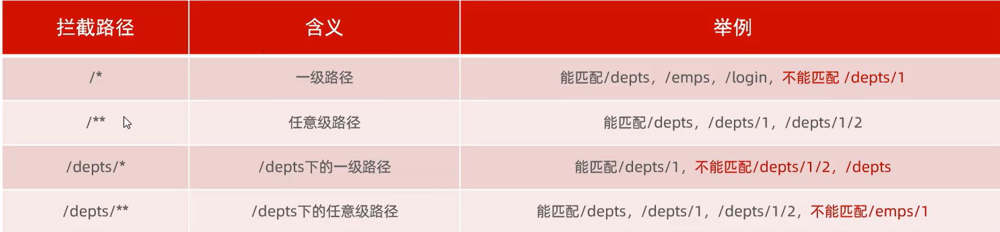
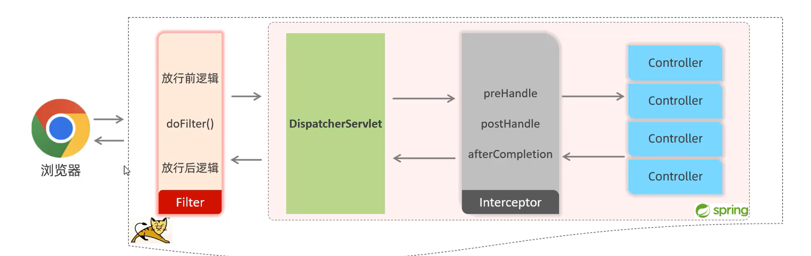

# 快速使用
## 定义拦截器
```java
@Component
public class loginIntercepter implements HandlerInterceptor{
    // 目标资源方法前运行，返回true放行
    @Override
    public boolean preHandle(HttpServletRequest request, HttpServletResponse response, Object handler) throws Exception {
        return true;
    }
    // 目标资源方法运行后执行
    @Override
    public void postHandle(HttpServletRequest request, HttpServletResponse response, Object handler, ModelAndView modelAndView) throws Exception {

    }
    // 视图渲染完毕后运行
    @Override
    public void afterCompletion(HttpServletRequest request, HttpServletResponse response, Object handler, Exception ex) throws Exception {
    }
}
```
## 注册拦截器
新建一个配置类
```java
@Configuration
public class webConfig implements WebMvcConfigurer {
    @Autowired
    private loginIntercepter loginIntercepter;
    @Override
    public void addInterceptors(InterceptorRegistry registry) {
        registry.addInterceptor(loginIntercepter).addPathPatterns("/**").excludePathPatterns("/login");
    }
}
```

# 拦截路径



# 执行流程



# filter与intercepter的区别
filter可以拦截服务器的一切资源，intercepter只能拦截spring环境中的资源