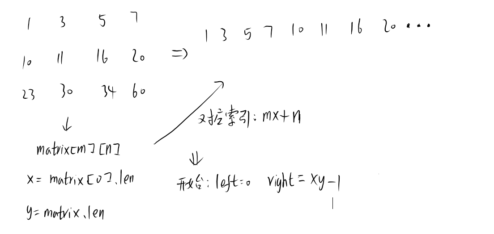

# 题目
给你一个满足下述两条属性的 m x n 整数矩阵：

每行中的整数从左到右按非严格递增顺序排列。
每行的第一个整数大于前一行的最后一个整数。
给你一个整数 target ，如果 target 在矩阵中，返回 true ；否则，返回 false 。

# 分析

# 代码
```java
class Solution {
    public boolean searchMatrix(int[][] matrix, int target) {
        int m = matrix.length;
        int n = matrix[0].length;
        int left = 0, right = m * n - 1;

        while (left <= right) {
            int mid = (left + right) / 2;
            int mid_m = mid / n;
            int mid_n = mid % n;
            if (matrix[mid_m][mid_n] > target) {
                right = mid - 1;
            } else if (matrix[mid_m][mid_n] < target) {
                left = mid + 1;
            } else {
                return true;
            }
        }
        return false;
    }
}
```