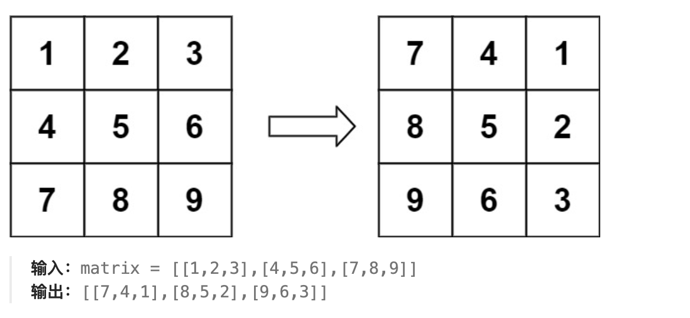
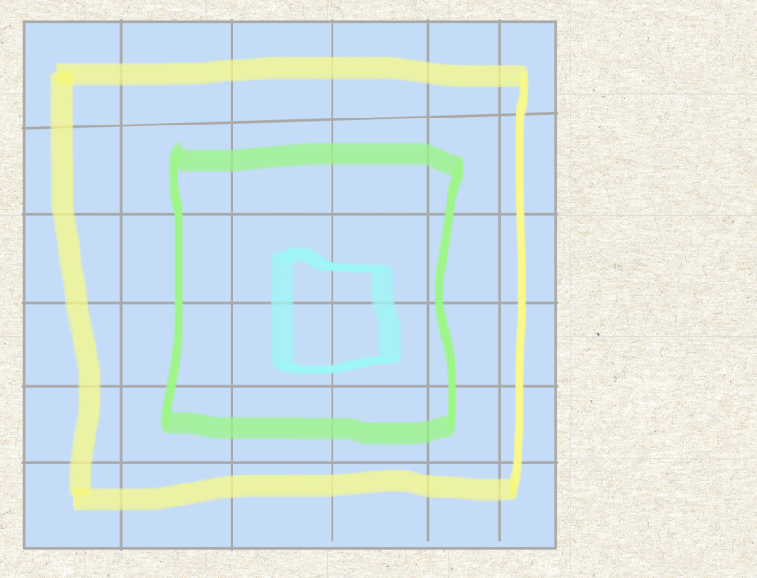
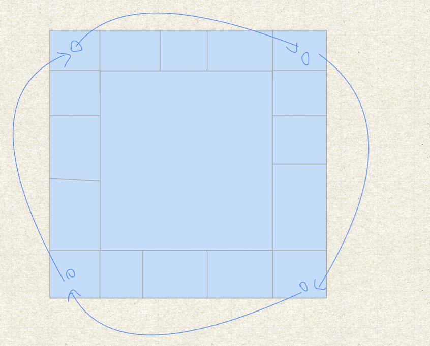

# 题目
给定一个 n × n 的二维矩阵 matrix 表示一个图像。请你将图像顺时针旋转 90 度。

你必须在 原地 旋转图像，这意味着你需要直接修改输入的二维矩阵。请不要 使用另一个矩阵来旋转图像。



# 分析
由于需要原地旋转，那么最直接的想法就是依次找到某个位置旋转后的位置。

具体来看，可以发现如果把矩阵分成多层结构，旋转后和原来位置仍处于同一层，图层结构如图所示。


所以，我们分层对矩阵进行处理 ，对于每一层可以发现替换是一个循环，如图


但我们也可以用翻转代替旋转，顺时针90度可以先水平轴翻转，再主对轴线翻转

# 题解
原地旋转
```java
class Solution {
    public void rotate(int[][] matrix) {
        int len = matrix.length;
        int Begin = 0;
        int End = len - 1;
        int tmp = 0;
        while (Begin < End) {
            for (int i = Begin; i < End; i++) {
                tmp = matrix[i][End];
                matrix[i][End] = matrix[Begin][i];
                matrix[Begin][i] = tmp;
                
                tmp = matrix[End][len-i-1];
                matrix[End][len-i-1] = matrix[Begin][i];
                matrix[Begin][i] = tmp;
                
                tmp = matrix[len-i-1][Begin];
                matrix[len-i-1][Begin] = matrix[Begin][i];
                matrix[Begin][i] = tmp;
            }
            Begin++;
            End--;
        }
    }
}
```

翻转
```java
class Solution {
    public void rotate(int[][] matrix) {
        int len = matrix.length;
        //水平翻转
        for (int i = 0; i < len/2; i++) {
            int des = len-i-1;
            for (int j = 0; j < len; j++) {
                int tmp = matrix[i][j];
                matrix[i][j] = matrix[des][j];
                matrix[des][j] = tmp;
            }
        }
        //主对轴线翻转
        for (int i = 0; i < len; i++) {
            for (int j = 0; j < i; j++) {
                int tmp = matrix[i][j];
                matrix[i][j] = matrix[j][i];
                matrix[j][i] = tmp;
            }
        }

    }
}
```