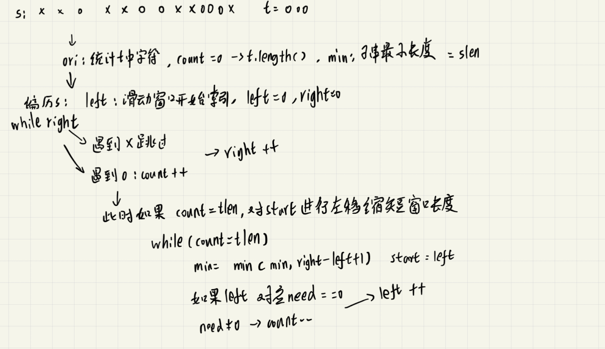

# 题目
给你一个字符串 s 、一个字符串 t 。返回 s 中涵盖 t 所有字符的最小子串。如果 s 中不存在涵盖 t 所有字符的子串，则返回空字符串 "" 。  

注意：

对于 t 中重复字符，我们寻找的子字符串中该字符数量必须不少于 t 中该字符数量。
如果 s 中存在这样的子串，我们保证它是唯一的答案。

输入：s = "ADOBECODEBANC", t = "ABC"  
输出："BANC"

m == s.length  
n == t.length  
1 <= m, n <= 105  
s 和 t 由英文字母组成

# 分析

总体来说就是运用滑动窗口，先不断将右侧右移，直到字符串覆盖，然后再不断将左侧右移，使满足覆盖的字符串最短

# 题解

```java
class Solution {
    public String minWindow(String s, String t) {
        int[] ori = new int[58];
        int[] have = new int[58];
        int sLen = s.length();
        int tLen = t.length();
        int min = s.length() + 1;   // 故意加1来预防s=t的情况
        int left = 0, right = 0,start = 0;
        int count = 0;
        String res = "";
        if (sLen < tLen)    return res;

        // 循环统计t中字符出现个数
        for (int i = 0; i < tLen; i++) {
            char tmp = t.charAt(i);
            ori[tmp - 65] ++;
        }

        while (right < sLen) {
            char tmp = s.charAt(right);
            if (ori[tmp-65] == 0) {
                right++;
                continue;
            }
            if (ori[tmp-65] > have[tmp-65]) {
                count++;
            }
            have[tmp-65]++;

            while (count == tLen) {
                if (right - left + 1 < min) {
                    min = right - left + 1;
                    start = left;
                }
                char dec = s.charAt(left);
                if (ori[dec - 65] == 0) {
                    left ++;
                    continue;
                }
                if (ori[dec - 65] == have[dec - 65]) {
                    count --;

                }
                have[dec - 65] --;
                left ++;
            }
            right ++;
        }
        if (min == s.length() + 1)  return "";
        res = s.substring(start, start + min);

        return res;
    }
}
```