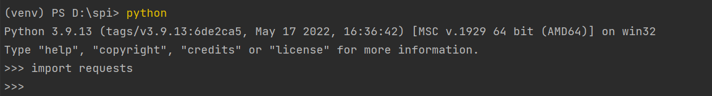
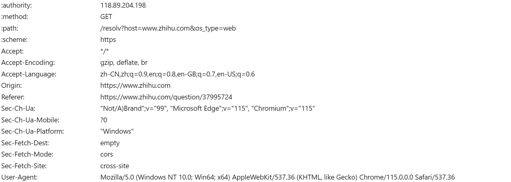

# 基本思想
利用Request库发起请求，得到响应数据；利用BeautifulSoup解析数据，进而获取页面标签中我们所需要的数据
# 使用条件
爬取网页内容静态呈现
# 使用技术介绍

## Request库
* 安装
```
pip3 install requests
```
* 检验安装成功
```
python 
import requests
```
查询结果如下  
 
* 常用方法

| 方法 | 作用 |
| :------ | :------ |
| rquest() | <div>最基本的方法，是之后应对不同请求方法的基本方法</div><div>用get()举例：</div><div>```def get(url, params=None, **kwargs):return request("get", url, params=params, **kwargs)```</div> |
| get() | 对应http中get方法 | 
| post() | 对应http中post方法 | 
| head() | 对应http中head方法 | 
| put() | 对应http中put方法 | 
| patch() | 对应http中patch方法 | 
| get() | 对应http中delete方法 | 
| |

传入参数：
| request() | 
| :------ |
| method:http请求类型（``GET``, ``OPTIONS``, ``HEAD``, ``POST``, ``PUT``, ``PATCH``, or ``DELETE``） | 
| url:网页链接 |
| header:请求头，模拟正常请求时会发送的一些必要内容（**详情见注解1**） |
| proxies:用来设置代理服务器（**详情见注解2**） | 
| timeout：设置超时（**详情见注解3**）|
| |

其他方法以request()为支撑省略了method，其他参数一样

> 注解

> 注解1：网页请求报文模板如下:  
> 
> 将其中数据成用字典封装  
> ```python 
>headers = {
>        "user-agent": "Mozilla/5.0 (Windows NT 10.0; WOW64)AppleWebKit/537.36 (KHTML, like Gecko) Chrome/81.0.4044.9 Safari/537.36"    }
> ```
> 一般说添加**user-agent**就可以了  

> 注解2：可以用proxies来切换发送请求的ip
> ```python
> proxies = { "http": "http://10.10.1.10:3128", "https": "http://10.10.1.10:1080", }
> ```
> 这样做的好处是不会因为爬虫频繁请求网页导致网站限制ip访问

> 注解3：用于限制接受响应的最大时间，超出则会报错，默认为不限时
> 也可以传入一个元组```r = requests.get('https://www.taobao.com',timeout=(5,30))```
> 分别代表连接时间和读取时间

## BeautifulSoup库
* 选择解析器解析指定内容
  
基本格式：```soup = BeautifulSoup(解析内容, 解析器)```

常用解析器：lxml, html(默认), xml...
> 注意：如果是标准正确的html内容，不同解析器解析结果相同；反之，会有不同

* 处理解析数据的方法

| 方法 | 参数 | 说明 | 
| :------ | :------ | :------ |
| find() | name,class_ | 查找HTML中第一个为类型为name，class为class_的标签 | 
| find_all() | name,class_ | 返回装有所有符合name，class的标签列表 | 
| text | ~ | 获取标签中内容 | 

* 网页中定位所要查找的内容

F12开发者工具 + 选中网页内容，右键检查

# 实战使用
* 目标：爬取**去哪儿旅行网**的不同省份的热门城市和景点数据（http://travel.qunar.com/p-sf297555-{省份的拼音小写}）

* 输入省份，获取该省的页面，爬取热门城市

```python
def get_soup_province():
    url = input('请输入要查询省份的去哪儿旅行网站链接：\n')
    # 请求头 浏览器类型
    headers = {
        "user-agent": "Mozilla/5.0 (Windows NT 10.0; WOW64) AppleWebKit/537.36 (KHTML, like Gecko) Chrome/81.0.4044.9 Safari/537.36"
    }
    response = requests.get(url, headers=headers);
    html = response.text
    soup = BeautifulSoup(html, 'lxml')
    return soup

province =  input('请输入省份：\n')

# 爬取输入省份的主要城市的url（每个省6个）
soup = get_soup_province()
cityMap = dict()
for li in soup.find_all(name='li', class_='sub_item'):
    city = li.a["title"]
    url = li.a["href"]

    if '旅游景点' in city:
        cityMap[city] = url
```
此时该省份下的最热门6个城市及其页面链接已经存入cityMap字典中

* 继续爬取6个热门城市的页面，获取其各自的前30景区信息

```python
city = [] # 景区归属城市
spotName = [] # 景点名称
score = []  # 景点满意度
ranking = []  # 排名
comments = [] # 简介

for key in cityMap:
    for i in range(1, 4):   # 每个城市爬取前30的景区   
        # url拼接：到达城市景点不同页数 http://travel.qunar.com/p-cs299782-xiamen-jingdian-1-2
        tmp = cityMap[key] + '-1-'
        url = tmp + str(i) # i 可以说代表页数
        soup = get_soup_url(url)

        # 景点名称
        for span in soup.find_all(name='span', class_='cn_tit'):
            city.append(key)
            spotName.append(span.text)
        print(spotName)

        # 评分（满意度）
        for span in soup.find_all(name='span', class_='cur_star'):
                percent = span['style']
                tmp = str(percent).split(':')[1]
                score.append(tmp)
        print(score)

        # 排名
        for span in soup.find_all(name='span', class_='ranking_sum'):
                ranking.append(span.text)
        print(ranking)

        # 简介
        for div in soup.find_all(name='div', class_='desbox'):
                comments.append(div.text)
        print(comments)

# 爬取每个景点需要的信息
map = {
    '所在城市':city,
    '景点名称': spotName,
    '满意度': score,
    '排名': ranking,
    '简介': comments
}
```
此时该省景区信息已经存入map字典中

* 存入数据库或者excel表格
  
```python
# excel表格
df = pd.DataFrame(map)
df.to_excel(province + ".xlsx", index=False)
```

```python
# 数据库
# 数据库连接
conn = pymysql.connect(
    host='127.0.0.1',
    user='root',
    password='1234',
    port=3306,
    database='mw')
cursor = conn.cursor()

# 保存到数据库
sql = "insert into tour (city, spotName, score, ranking, comments) values(%s，%s，%s，%s，%s)"
for lt in lst:
    col1 = city.pop()
    col2 = spotName.pop()
    col3 = score.pop()
    col4 = ranking.pop()
    col5 = comments.pop()
    insert = cursor.execute(sql, (col1, col2, col3, col4, col5))

cursor.close()
conn.commit()
# 关闭连接
conn.close()

```

* 完整代码  
```python
import requests

from bs4 import BeautifulSoup
import pandas as pd


# 'https://travel.qunar.com/p-sf298098-fujian'
# 爬取省份下城市soup
def get_soup_province():
    url = input('请输入要查询省份的去哪儿旅行网站链接：\n')
    # 请求头 浏览器类型
    headers = {
        "user-agent": "Mozilla/5.0 (Windows NT 10.0; WOW64) AppleWebKit/537.36 (KHTML, like Gecko) Chrome/81.0.4044.9 Safari/537.36"
    }
    response = requests.get(url, headers=headers);
    html = response.text
    soup = BeautifulSoup(html, 'lxml')
    return soup

# 爬取城市下景点soup
# 爬取景点内容soup

def get_soup_url(url):
    # 请求头 浏览器类型
    headers = {
        "user-agent": "Mozilla/5.0 (Windows NT 10.0; WOW64) AppleWebKit/537.36 (KHTML, like Gecko) Chrome/81.0.4044.9 Safari/537.36"
    }
    response = requests.get(url, headers=headers);
    html = response.text
    soup = BeautifulSoup(html, 'lxml')
    return soup


province =  input('请输入省份：\n')

# 爬取输入省份的主要城市的url（每个省6个）
soup = get_soup_province()
cityMap = dict()
for li in soup.find_all(name='li', class_='sub_item'):
    city = li.a["title"]
    url = li.a["href"]

    if '旅游景点' in city:
        cityMap[city] = url
# print(cityMap)

# 爬取各城市的景点链接（按人气排名前百的城市）
city = []
spotName = []
score = []
ranking = []
comments = []

for key in cityMap:
    for i in range(1, 4):   
        # url拼接：到达城市景点不同页数 http://travel.qunar.com/p-cs299782-xiamen-jingdian-1-2
        tmp = cityMap[key] + '-1-'
        url = tmp + str(i)
        soup = get_soup_url(url)

        # 景点名称
        for span in soup.find_all(name='span', class_='cn_tit'):
            city.append(key)
            spotName.append(span.text)
        print(spotName)

        # 评分（满意度）
        for span in soup.find_all(name='span', class_='cur_star'):
                percent = span['style']
                tmp = str(percent).split(':')[1]
                score.append(tmp)
        print(score)

        # 排名
        for span in soup.find_all(name='span', class_='ranking_sum'):
                ranking.append(span.text)
        print(ranking)

        # 简介
        for div in soup.find_all(name='div', class_='desbox'):
                comments.append(div.text)
        print(comments)

# 爬取每个景点需要的信息
map = {
    '所在城市':city,
    '景点名称': spotName,
    '满意度': score,
    '排名': ranking,
    '简介': comments
}
df = pd.DataFrame(map)
df.to_excel(province + ".xlsx", index=False)

```