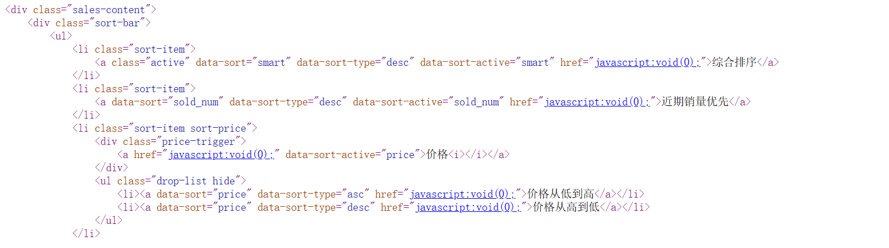
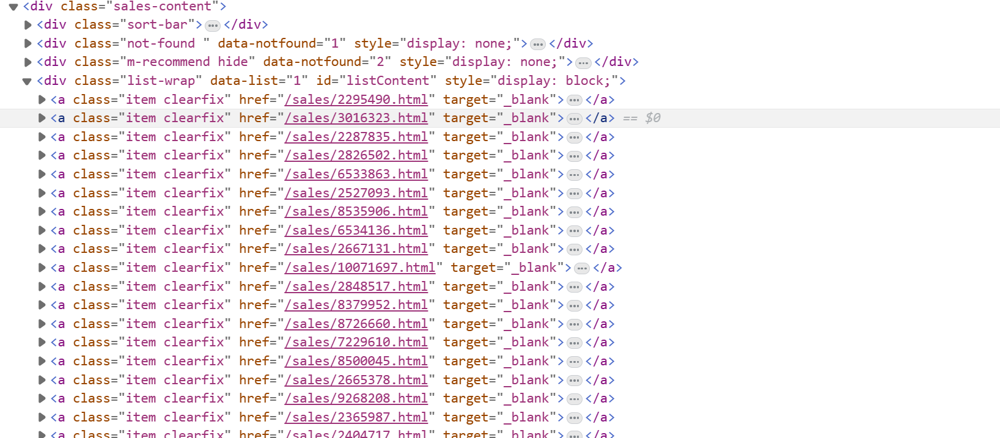
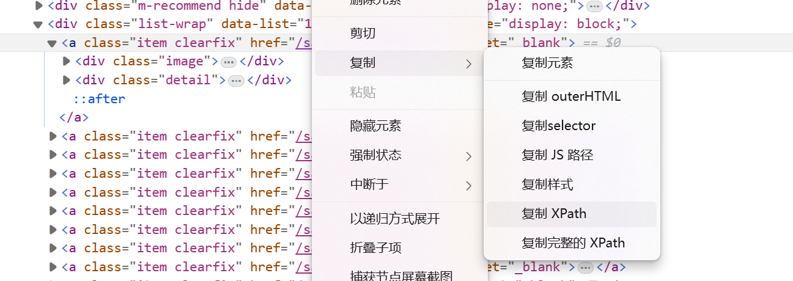
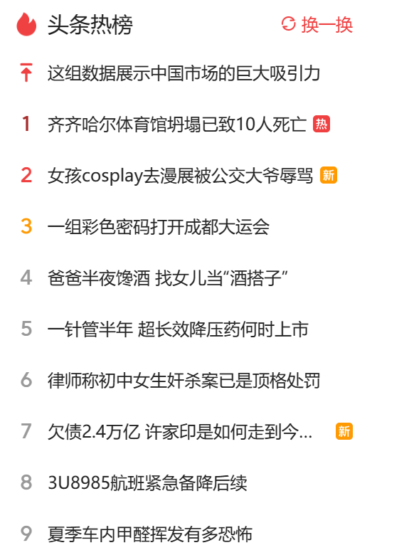
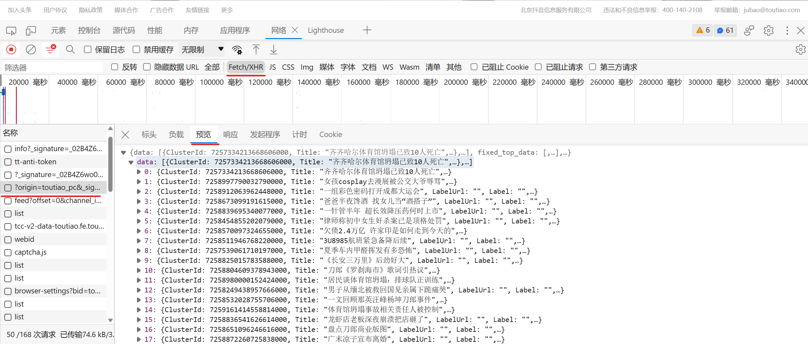
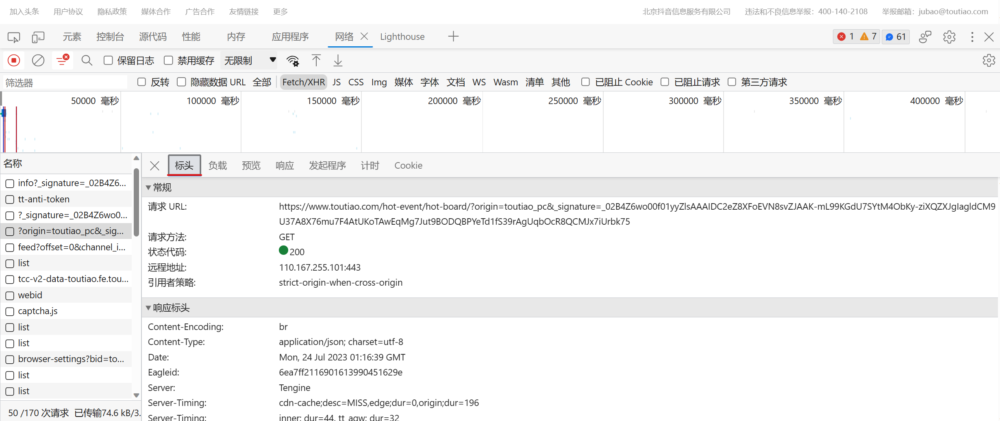
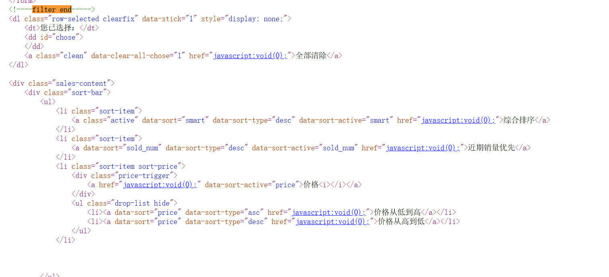
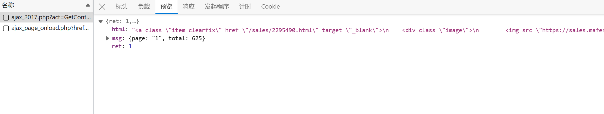

# 动态网页
动态网页的数据不会出现在页面的源代码中  
比如说马蜂窝网的自由行页面（https://www.mafengwo.cn/sales/0--M10030P%E6%B5%B7%E5%8D%97-0-0-0-0-0.html）
* 页面 
   
* 其中活动列表的页面源码



* 渲染后页面
  


可以发现渲染前数据是没有的，如果我们像爬取静态网页一样爬取，那么只能得到未渲染的html结构

# 爬取方法一（selenium模拟浏览器）
## 配置环境
* 安装selenium

```
pip install selenium
```
* 安装谷歌浏览器
* 安装chromedriver

> 注意查看自己谷歌浏览器版本，然后下载对应（大版本相同即可）的chromedriver  
> 链接：https://registry.npmmirror.com/binary.html?path=chromedriver/  
> 解压后将其放到Python安装路径下  

## 实现（爬取动态页面内容 + 虚拟点击翻页）
* 目标：爬取三亚自由行（https://www.mafengwo.cn/sales/0--M10030P%E6%B5%B7%E5%8D%97-0-0-0-0-0.html）的第前6页活动
### 获取渲染后的页面
```Python
browser = webdriver.Chrome()
browser.get(url1)
``` 
### 定位爬取内容的方法
#### F12打开页面元素如图获取xpath



#### 获取元素中想要的部分

```python
element = browser.find_element_by_xpath('xpath')
```

#### 进一步获取

```Python
element.get_property(属性) # 获取属性的内容
```

使用：  

```html
element:<a href = "/sales/21023.html"></a>
```

```python
element.get_property('href') # 获取了<a>标签中的链接"/sales/21023.html"
```
 
 <br>-------------------------------------------------------------------------- </br> 

```python
element.text # 获取标签的内容
```

使用：

```html
element:<a>hello</a>
```

```python
element.text # 得到hello
```

 <br>-------------------------------------------------------------------------- </br> 

```python
element.find_element_by_link_text(标签内容) #根据标签内容获取标签（反过来）
```

使用:

```html
element:<a href="javascript:void(0);" class="pi pg-next">Next>></a>
```

```python
next_page = element.find_element_by_link_text('Next>>') # 得到标签，可以模拟其功能。这里是一个跳转到下一页的标签，所以可以调用click()模拟跳转
next_page.click()
```

 <br>-------------------------------------------------------------------------- </br> 

 ```python
 element.find_element_by_class_name(class属性内容)
 ```

 经常使用

当然还有许多方法，这里不多叙述
     
        
### 完整代码

输入某城市自由行页面第一页链接即可爬取6页活动（example：'https://www.mafengwo.cn/sales/0-10320-M14674-0-0-0-0-0.html?group=1&seid=23F35AC5-65E0-4048-8F1B-4677F6B87E7A'）
 
```python
from selenium import webdriver
from bs4 import BeautifulSoup
from selenium.webdriver.support.ui import WebDriverWait
from selenium.webdriver.common.by import By
import requests
from selenium.webdriver.support import expected_conditions


headers = {
    "User-Agent":"Mozilla/5.0 (Windows NT 10.0; Win64; x64) AppleWebKit/537.36 (KHTML, like Gecko) Chrome/114.0.0.0 Safari/537.36 Edg/114.0.1823.67"
}

url = input('某城市自由行页面链接：')
browser = webdriver.Chrome()
browser.get(url)
locator = (By.LINK_TEXT, 'Next>>')

WebDriverWait(browser, 16).until(expected_conditions.presence_of_element_located(locator))

htmls = []

f = open("activities.txt", "w", encoding='UTF-8')
for i in range(1, 5):
    # 获取每个活动的网页链接
    for aTag in range(1, 21):
        element = browser.find_element_by_xpath('/html/body/div[2]/div[2]/div[4]/a[' + str(aTag) + ']')
        htmls.append(element.get_property('href'))

    # print(htmls)
    # 获取活动的html
    # https://www.mafengwo.cn/sales/2295490.html

    for url in htmls:
        response = requests.get(url, headers=headers);
        html = response.text
        soup = BeautifulSoup(html, 'lxml')
        tmp = soup.find(name='div', class_='sales-title')
        if tmp != None:
            tmp = tmp.find(name='h1')
            if tmp != None:
                service = tmp.text
            else:
                service = '***'
        else:
            service = '***'
        print(service)
        tmp = soup.find(name='strong', class_='js_dingzhi_price')
        if tmp != None:
            price = tmp.text
        else:
            price = '***'
        print(price)
        tmp = soup.find(name='span', class_='soldout')
        if tmp != None:
            sold = tmp.text
        else:
            sold = '***'

        activity = service + ',' + price + ',' + sold
        f.write(activity)
        f.write('\n')
    # 实现虚拟点击
    next_page = browser.find_element_by_link_text('Next>>')
    next_page.click()
f.close()
```

# 爬取方法二（通过javsript逆向获取数据接口）
基本方法：在需要爬取网页F12选择网络，选择XHR,点击名称，选择预览。依次查看预览，找到想要爬取的内容，再切换到标头，找到请求url（真实需要爬取的链接），用该链接爬取预览中的内容（大部分是json）  
好处：比selenium效率更高
## 爬取今日头条的头条热榜（https://www.toutiao.com/）  

### 分析


  


可以发现头条热榜中内容是json格式

### 实现

```python
import requests

url = 'https://www.toutiao.com/hot-event/hot-board/?origin=toutiao_pc&_signature=_02B4Z6wo00f01cm1l.wAAIDAPMp9YrQAl5HJkZNAABbSIRLm0FZII5tPd8u2PIsOqj1YucYIEdGWkcDPpbZOxzsho28lefSfMc0QiN1YHh9hAjgdADwz4lHocFqMV1YF3n8um5OwWNJj77DX16'

headers = {
    "User-Agent":"Mozilla/5.0 (Windows NT 10.0; Win64; x64) AppleWebKit/537.36 (KHTML, like Gecko) Chrome/114.0.0.0 Safari/537.36 Edg/114.0.1823.67"
}

response = requests.get(url, headers=headers)
json = response.json()
for i in range(0, len(json['data'])):
    print(json['data'][i]['Title'])
```

## 爬取马蜂窝网自由行列表（https://www.mafengwo.cn/sales/0-0-M10030-0-0-0-0-0.html）

### 分析





可以发现这个页面全部把数据存到了html中

### 实现
```python
import requests
from bs4 import BeautifulSoup

url = 'https://www.mafengwo.cn/sales/ajax_2017.php?act=GetContentList&s_dept_time%5B%5D=all&price%5B%5D=all&from=NaN&kw=&to=M10030&salesType=NaN&page=1&group=1&sort=smart&sort_type=desc&limit=20'
headers = {
    "User-Agent": "Mozilla/5.0 (Windows NT 10.0; Win64; x64) AppleWebKit/537.36 (KHTML, like Gecko) Chrome/114.0.0.0 Safari/537.36 Edg/114.0.1823.67"
}

response = requests.get(url, headers=headers)
json = response.json()
html = json['html']
soup = BeautifulSoup(html, 'lxml')
for h3 in soup.find_all(name='h3'):
    print(h3.text)

```
此时如果需要翻页，可以发现每一页的链接发生变化，使用了page=x来表示第x页。所以创建循环拼接链接就可以了