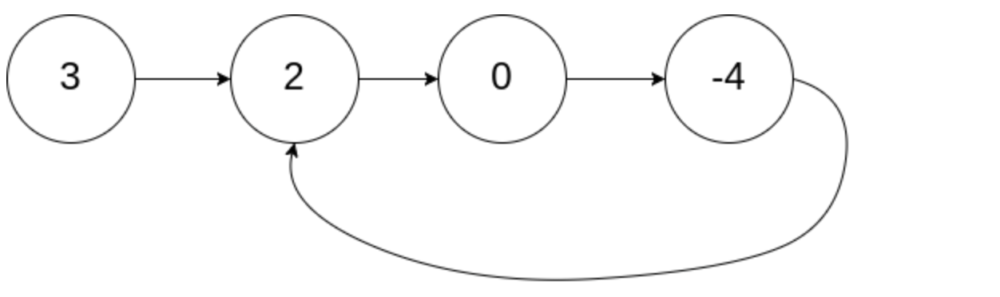
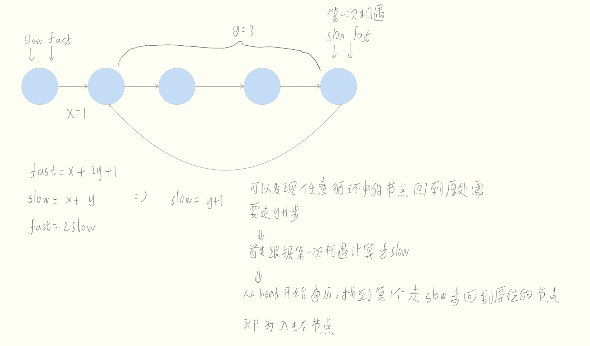
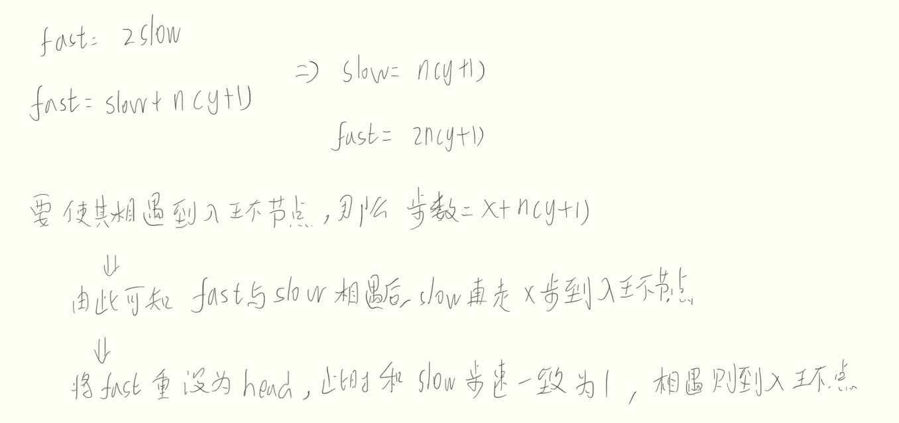

# 题目
给你一个链表的头节点 head ，判断链表中是否有环。 


再进一步，检测一个链表是否有环。如果没有环，返回null；如果有环，返回链表开始入环的第一个节点

# 分析

如果只是检测链表是否有环，可以遍历链表，用哈希表记录遍历过的节点。如果出现重复，那么有环；如果遍历到null，那没有环。  
如果不想浪费空间，可以选择利用快慢指针同时遍历链表，如果某一刻遍历到相同节点，那么有循环；如果某一刻快指针遍历到null，那么没有环。

如果要寻找入环节点，不考虑空间成本当然可以使用哈希。但如果要节省空间，那么可以先使用快慢指针。  
由于在判断是否有环时，我们是根据第一次相遇进行判断的。在快指针走2，慢指针走1，起点都为head的情况下，相遇有以下等式：

但是这样做，实际上是找到先找到环的节点数，然后依次去判断每个节点是否能回到原位。所以时间上会消耗较多。如果我们考虑最好的情况：相遇在入环点，那么有如下等式：


# 题解
* 判断链表中是否有环   

哈希表
```java
/**
 * Definition for singly-linked list.
 * class ListNode {
 *     int val;
 *     ListNode next;
 *     ListNode(int x) {
 *         val = x;
 *         next = null;
 *     }
 * }
 */
public class Solution {
    public boolean hasCycle(ListNode head) {
        Set<ListNode> count = new HashSet<>();
        while (head != null){
            if (!count.contains(head.next)) {
                count.add(head.next); 
                head = head.next;
            } else {
                return true;
            }
            
        }
        return false;
    }
}
```
快慢指针
```java
/**
 * Definition for singly-linked list.
 * class ListNode {
 *     int val;
 *     ListNode next;
 *     ListNode(int x) {
 *         val = x;
 *         next = null;
 *     }
 * }
 */
public class Solution {
    public boolean hasCycle(ListNode head) {
         if (head == null || head.next == null) return false;

        ListNode slow = head;
        ListNode fast = head.next;

        while (fast != slow) {
            if (fast.next == null || fast.next.next == null) {
                return false;
            }
            fast = fast.next.next;
            slow = slow.next;

        }
        return true;
    }
}
```

* 查询入环节点

先获取环节点数，再遍历的方法
```java
/**
 * Definition for singly-linked list.
 * class ListNode {
 *     int val;
 *     ListNode next;
 *     ListNode(int x) {
 *         val = x;
 *         next = null;
 *     }
 * }
 */
public class Solution {
    public ListNode detectCycle(ListNode head) {
        if (head == null || head.next == null) return null;

        ListNode slow = head;
        ListNode fast = head;

        int step = 0;
        do {
            if (fast.next == null || fast.next.next == null) {
                return null;
            }
            fast = fast.next.next;
            slow = slow.next;
            step++;
        } while (fast != slow);

        while (!circle(head,step)) {
            head = head.next;
        }
        return head;
    }

    public static boolean circle(ListNode no, int step) {
        ListNode tmp = no;
        for (int i = 0; i < step; i++) {
            tmp = tmp.next;
        }
        if (tmp == no) {
            return true;
        }
        return false;
    }
}
```

第二次相遇

```java
/**
 * Definition for singly-linked list.
 * class ListNode {
 *     int val;
 *     ListNode next;
 *     ListNode(int x) {
 *         val = x;
 *         next = null;
 *     }
 * }
 */
public class Solution {
    public ListNode detectCycle(ListNode head) {
        if (head == null || head.next == null) return null;

        ListNode slow = head;
        ListNode fast = head;
        
        do {
            if (fast.next == null || fast.next.next == null) {
                return null;
            }
            fast = fast.next.next;
            slow = slow.next;
            
        } while (fast != slow);
        
        fast = head;
        while (fast != slow) {
            fast = fast.next;
            slow = slow.next;
        }
        return slow;
    }
}
```