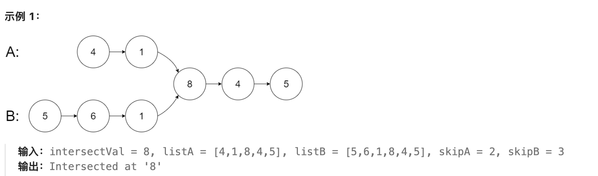

# 题目

给你两个单链表的头节点 headA 和 headB ，请你找出并返回两个单链表相交的起始节点。如果两个链表不存在相交节点，返回 null 。



# 分析
可以先遍历A链表，把每个节点存入哈希表中，再遍历B链表，检查节点是否存在于哈希表中

但更好的方法是A和B链表同时遍历，A链表如果遍历完那么跳转到B链表开头继续遍历，B跳到A开头。假设到达共同节点前A链表有a个节点，B有b个节点，共同节点及之后节点有c个。那么A链表遍历第一次到节点需a次，第二次到交点需a+c+1+b次（末尾有一个null），B链表第二次到交点需b+c+1+a次，可知他们会同时到达。如果两链表不相交，那么会同时到达末尾null

# 题解
哈希
```java
/**
 * Definition for singly-linked list.
 * public class ListNode {
 *     int val;
 *     ListNode next;
 *     ListNode(int x) {
 *         val = x;
 *         next = null;
 *     }
 * }
 */
public class Solution {
    public ListNode getIntersectionNode(ListNode headA, ListNode headB) {
        Set<ListNode> con = new HashSet<>();
        while (headA != null) {
            con.add(headA);
            headA = headA.next;
        }
        while (headB != null) {
            if (con.contains(headB)) {
                return headB;
            }
            headB = headB.next;
        }
        return null;
    }
}
```

双指针
```java
/**
 * Definition for singly-linked list.
 * public class ListNode {
 *     int val;
 *     ListNode next;
 *     ListNode(int x) {
 *         val = x;
 *         next = null;
 *     }
 * }
 */
public class Solution {
    public ListNode getIntersectionNode(ListNode headA, ListNode headB) {
        if (headA == null || headB == null) return null;
        ListNode A = headA;
        ListNode B = headB;
        while (A != B) {
            if (A != null) {
                A = A.next;
            } else {
                A = headB;
            }

            if (B != null) {
                B = B.next;
            } else {
                B = headA;
            }
        }

        return A;
    }
}
```