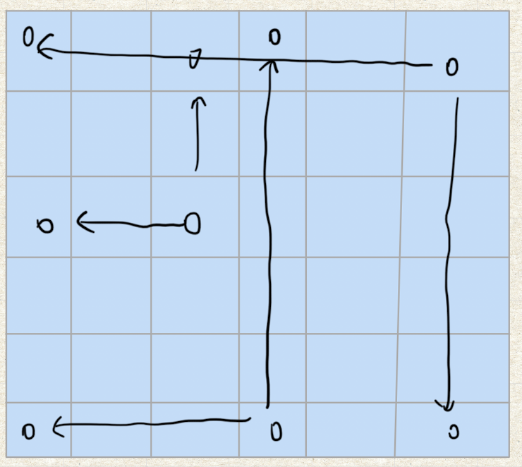

# 题目
给定一个 m x n 的矩阵，如果一个元素为 0 ，则将其所在行和列的所有元素都设为 0 。请使用 原地算法。

输入：matrix = [[1,1,1],[1,0,1],[1,1,1]]  
输出：[[1,0,1],[0,0,0],[1,0,1]]


输入：matrix = [[0,1,2,0],[3,4,5,2],[1,3,1,5]]  
输出：[[0,0,0,0],[0,4,5,0],[0,3,1,0]]

# 分析
最简单的办法是使用**标记数组**记录需要变为0的行和列,但这样会浪费空间去创建标记数组

所以，我们可以用矩阵的第一列和第一行去记录矩阵这一列一行是否需要变为0.值得注意的是一般情况下第一行某个位置为0代表这一列为0，但如果第一行本身就有位置为0，那么该行在所有列都变为0后有需要变为0

这种情况下我们可以先用两个变量去记录第一行和第一列是否有0存在

在上述方法中我们需要创建两个变量，但如果我们只用一个变量去记录第一列是否有0存在，那么我们可以用第一列的第一行去表示第一行是否有0存在。只不过要从最后一行开始赋值，防止把第一行的记录给弄没了。
# 题解
标记数组
```java
class Solution {
    public void setZeroes(int[][] matrix) {
        int x = matrix[0].length;   //列数
        int y = matrix.length;  //行数
        int[] xArray = new int[x];
        int[] yArray = new int[y];
        for (int i = 0; i < y; i++) {
            for (int j = 0; j < x; j++) {
                if (matrix[i][j] == 0) {
                    xArray[j] = 1;
                    yArray[i] = 1;
                }
            }
        }

        for (int i = 0; i < y; i++) {
            if (yArray[i] == 1) {
                for (int j = 0; j < x; j++) {
                    matrix[i][j] = 0;
                }
            }
        }

        for (int i = 0; i < x; i++) {
            if (xArray[i] == 1) {
                for (int j = 0; j < y; j++) {
                    matrix[j][i] = 0;
                }
            }
        }
    }
}
```

两个变量
```java
class Solution {
    public void setZeroes(int[][] matrix) {
        int x0 = 0; //第一行是否有0
        int y0 = 0; //第一列是否有0
        int x = matrix[0].length;   //列数
        int y = matrix.length;  //行数
        
        for (int i = 0; i < x; i++) {
            if (matrix[0][i] == 0) {
                x0 = 1;
                break;
            }
        }

        for (int i = 0; i < y; i++) {
            if (matrix[i][0] == 0) {
                y0 = 1;
                break;
            }
        }

        for (int i = 1; i < y; i++) {
            for (int j = 1; j < x; j++) {
                if (matrix[i][j] == 0) {
                    matrix[i][0] = 0;
                    matrix[0][j] = 0;
                }
            }
        }

        for (int i = 1; i < y; i++) {
            for (int j = 1; j < x; j++) {
                if (matrix[i][0] == 0 || matrix[0][j] == 0) {
                    matrix[i][j] = 0;
                }
            }
        }

        if (x0 == 1) {
            for (int i = 0; i < x; i++) {
                matrix[0][i] = 0;
            }
        }

        if (y0 == 1) {
            for (int i = 0; i < y; i++) {
                matrix[i][0] = 0;
            }
        }
    }
}
```

一个变量
```java
class Solution {
    public void setZeroes(int[][] matrix) {
        int y0 = 0; //第一列是否有0
        int x = matrix[0].length;   //列数
        int y = matrix.length;  //行数

        for (int i = 0; i < y; i++) {
            if (matrix[i][0] == 0) {
                y0 = 1;
                break;
            }
        }

        for (int i = 0; i < y; i++) {
            for (int j = 1; j < x; j++) {
                if (matrix[i][j] == 0) {
                    matrix[i][0] = 0;
                    matrix[0][j] = 0;
                }
            }
        }

        for (int i = y-1; i >= 0; i--) {
            for (int j = 1; j < x; j++) {
                if (matrix[i][0] == 0 || matrix[0][j] == 0) {
                    matrix[i][j] = 0;
                }

            }
        }

        if (y0 == 1) {
            for (int i = 0; i < y; i++) {
                matrix[i][0] = 0;
            }
        }
    }
}
```