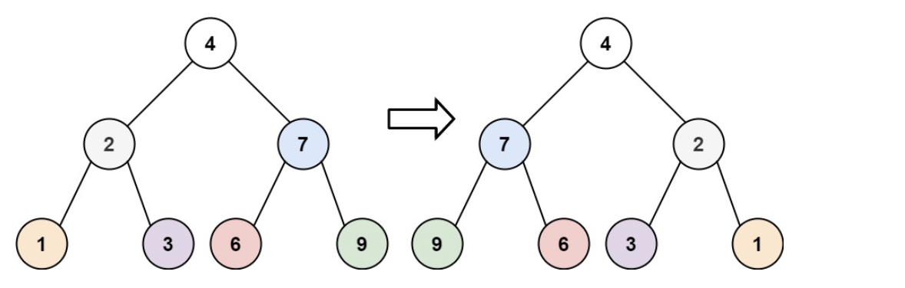

# 题目
将二叉树的左右节点进行翻转

# 代码
```java
/**
 * Definition for a binary tree node.
 * public class TreeNode {
 *     int val;
 *     TreeNode left;
 *     TreeNode right;
 *     TreeNode() {}
 *     TreeNode(int val) { this.val = val; }
 *     TreeNode(int val, TreeNode left, TreeNode right) {
 *         this.val = val;
 *         this.left = left;
 *         this.right = right;
 *     }
 * }
 */
class Solution {
    public TreeNode invertTree(TreeNode root) {
        if (root == null) return null;
        TreeNode tmp = root.left;
        root.left = invertTree(root.right);
        root.right = invertTree(tmp);
        return root;
    }
}
```