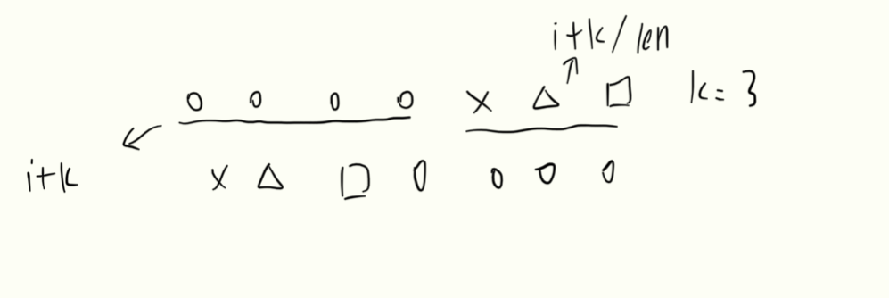

# 题目
给定一个整数数组 nums，将数组中的元素向右轮转 k 个位置，其中 k 是非负数。

输入: nums = [1,2,3,4,5,6,7], k = 3  
输出: [5,6,7,1,2,3,4]

# 分析

* 可以新建一个等长数组，按照轮转后的顺序存入即可  
要注意的是如果轮转次数大于数组长情况的处理

* 既然我们知道了原来索引为i的数字轮转后索引为i+k/len,

# 题解

```java
class Solution {
    public void rotate(int[] nums, int k) {
        int len = nums.length;
        int[] tmp = new int[len];
        int split = len - k;
        while (split < 0) {
            split += len;
        }
        int index = 0;
        
        for (int i = split; i < len; i++) {
            tmp[index] = nums[i];
            index ++;
        }
        for (int i = 0; i < split; i++) {
            tmp[index] = nums[i];
            index ++;
        }
        System.arraycopy(tmp, 0, nums, 0, len);
    }
}
```

```java
class Solution {
    public void rotate(int[] nums, int k) {
        int n = nums.length;
        int[] newArr = new int[n];
        for (int i = 0; i < n; ++i) {
            newArr[(i + k) % n] = nums[i];
        }
        System.arraycopy(newArr, 0, nums, 0, n);
    }
}
```