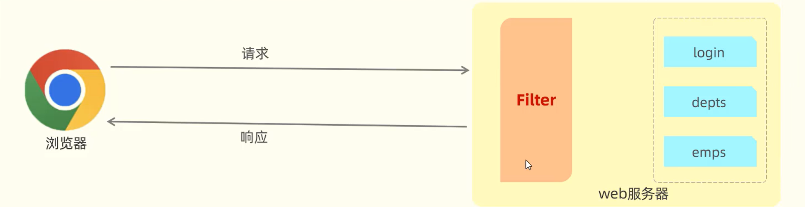
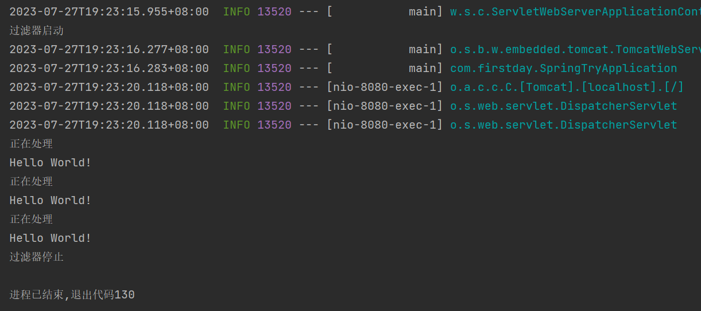
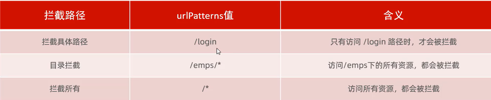
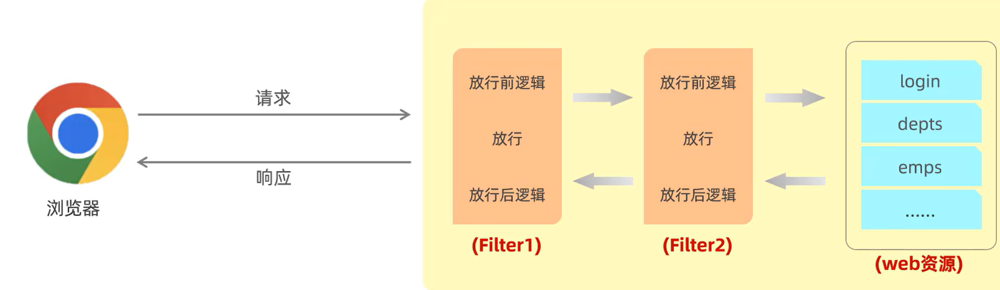
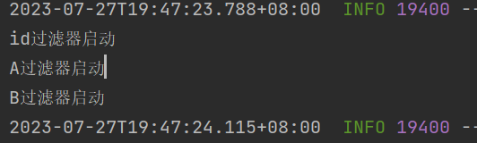
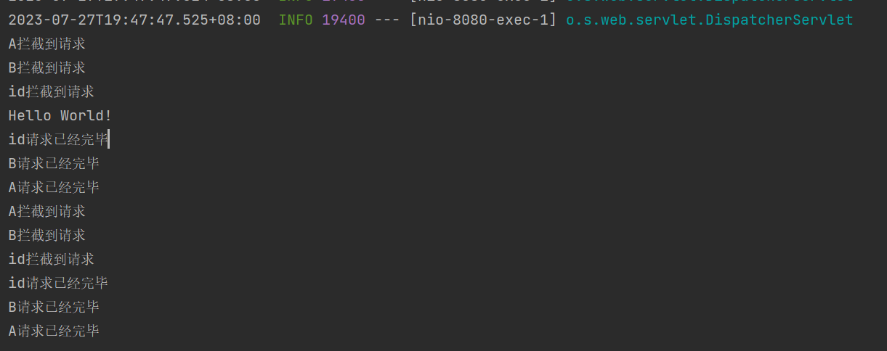
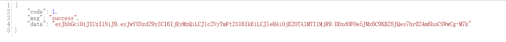
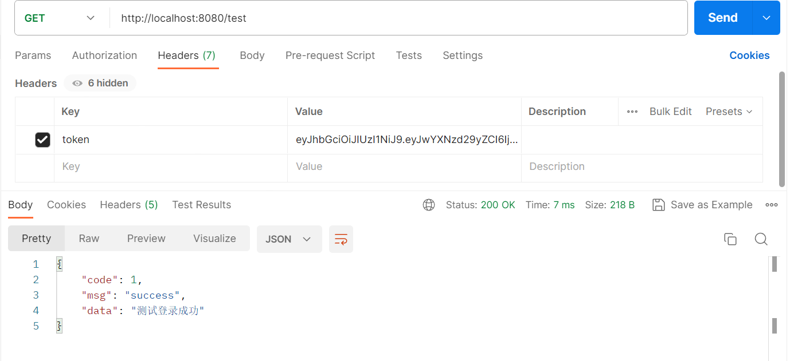

# 概述
拦截对资源的请求


# 快速使用

## 定义filter类

```java
import jakarta.servlet.*;
import jakarta.servlet.annotation.WebFilter;

import java.io.IOException;

@WebFilter(urlPatterns = "/*") //用于指定拦截路径
public class idFilter implements Filter {
    // 初始化
    @Override
    public void init(FilterConfig filterConfig) throws ServletException {
        System.out.println("过滤器启动");
    }
    // 服务器停止时调用
    @Override
    public void destroy() {
        System.out.println("过滤器停止");
    }
    //拦截到请求后调用
    @Override
    public void doFilter(ServletRequest servletRequest, ServletResponse servletResponse, FilterChain filterChain) throws IOException, ServletException {
        //放行前逻辑
        System.out.println("正在处理");
        //放行
        filterChain.doFilter(servletRequest,servletResponse);
        //放行后逻辑
    }
}

```

## 启动类上添加注解（@ServletComponentScan）

```java
@ServletComponentScan
@SpringBootApplication
@MapperScan(basePackages = "com.firstday.mapper")
public class SpringTryApplication {

    public static void main(String[] args) {
        SpringApplication.run(SpringTryApplication.class, args);
    }
}

```

## 测试
随便写个接口
```java
@RestController
public class HelloController {
    @RequestMapping("/hello")
    public String hello(){
        System.out.println("Hello World!");
        return "Hello World!";
    }
}
```
启动服务，访问localhost:8080/hello,不断刷新，最后关闭服务


# 拦截路径


# 过滤器链
按照过滤器名称**字母顺序**依次执行：过滤前逻辑1-》放行1-》过滤前逻辑2-》放行2-》过滤前逻辑3-》放行3-》资源-》过滤后逻辑3-》过滤后逻辑2-》过滤后逻辑1

## 测试
改写idFilter,并新增AFilter，BFilter
```java
@WebFilter(urlPatterns = "/*")
public class idFilter implements Filter {
    @Override
    public void init(FilterConfig filterConfig) throws ServletException {
        System.out.println("id过滤器启动");
    }

    @Override
    public void destroy() {
        System.out.println("id过滤器停止");
    }

    @Override
    public void doFilter(ServletRequest servletRequest, ServletResponse servletResponse, FilterChain filterChain) throws IOException, ServletException {
        System.out.println("id拦截到请求");
        //放行
        filterChain.doFilter(servletRequest,servletResponse);
        System.out.println("id请求已经完毕");
    }
}
```

```java
@WebFilter(urlPatterns = "/*")
public class AFilter implements Filter {
    @Override
    public void init(FilterConfig filterConfig) throws ServletException {
        System.out.println("A过滤器启动");
    }

    @Override
    public void doFilter(ServletRequest servletRequest, ServletResponse servletResponse, FilterChain filterChain) throws IOException, ServletException {
        System.out.println("A拦截到请求");
        filterChain.doFilter(servletRequest,servletResponse);
        System.out.println("A请求已经完毕");
    }

    @Override
    public void destroy() {
        System.out.println("A过滤器销毁");
    }
}
```

```java
@WebFilter(urlPatterns = "/*")
public class BFilter implements Filter {

    @Override
    public void init(FilterConfig filterConfig) throws ServletException {
        System.out.println("B过滤器启动");
    }

    @Override
    public void doFilter(ServletRequest servletRequest, ServletResponse servletResponse, FilterChain filterChain) throws IOException, ServletException {
        System.out.println("B拦截到请求");
        filterChain.doFilter(servletRequest,servletResponse);
        System.out.println("B请求已经完毕");
    }

    @Override
    public void destroy() {
        System.out.println("B过滤器销毁");
    }
}

```
启动服务，访问/hello，控制台如下

可见初始化非字母顺序


但拦截请求放行顺序是按照filter字母顺序放行的（A->B->i）

# filter实际使用
使用filter进行一个登录校验
## 令牌工具类
```java
public class GenJWT {
    public static String secret = "qweuih";
    public static String creJWT(Map<String, Object> claims){

        String jwt = Jwts.builder()
                .setClaims(claims)
                .signWith(SignatureAlgorithm.HS256, secret)//设置签名算法
                .setExpiration(new Date(System.currentTimeMillis() + 3600*1000))
                .compact();
        return jwt;
    }

    public static Claims parseJWT(String jwt) {
        Claims claims = Jwts.parser()
                .setSigningKey(secret)
                .parseClaimsJwt(jwt)
                .getBody();
        return claims;
    }

}

```
## 写一个登录用的接口
```java
@RestController
public class loginController {
    @GetMapping("/login")
    public Result login(@PathParam("name") String name, @PathParam("password") String password){
        System.out.println(name + ":" + password + "正在登录");
        HashMap<String, String> user = new HashMap<>();
        user.put("A", "1234");
        user.put("B", "1112");
        user.put("C", "1122");
        if (user.containsKey(name) && user.get(name).equals(password)){
            HashMap<String, Object> claims = new HashMap<>();
            claims.put("userName", name);
            claims.put("password", password);
            String jwt = GenJWT.creJWT(claims,"qweuih");
            return Result.success(jwt);
        }
        return Result.error("未登录");
    }

    @GetMapping("/test")
    public Result test(){
        return Result.success("测试登录成功")
    }
}
```
## 过滤器
```java
@WebFilter(urlPatterns = "/*")
public class AFilter implements Filter {
    @Override
    public void init(FilterConfig filterConfig) throws ServletException {
        System.out.println("A过滤器启动");
    }

    @Override
    public void doFilter(ServletRequest servletRequest, ServletResponse servletResponse, FilterChain filterChain) throws IOException, ServletException {
        HttpServletRequest req = (HttpServletRequest)servletRequest;
        HttpServletResponse rep = (HttpServletResponse)servletResponse;

        String url = req.getRequestURL().toString();
        // 判断是否是登录请求
        if (url.contains("login")){
            filterChain.doFilter(servletRequest,servletResponse);
            return;
        }
        // 获取请求头中的jwt
        String jwt = req.getHeader("token");
        if (!StringUtils.hasLength(jwt)){
            Result error = Result.error("未登录");
            String res = JSONObject.toJSONString(error);
            rep.getWriter().write(res);
            return;
        }
        try {
            GenJWT.parseJWT(jwt);
        } catch (Exception e){
            System.out.println("解析失败");
            Result error = Result.error("未登录");
            String res = JSONObject.toJSONString(error);
            rep.getWriter().write(res);
            return;
        }
        System.out.println("已登录用户，放行");
        filterChain.doFilter(servletRequest, servletResponse);
    }

    @Override
    public void destroy() {
        System.out.println("A过滤器销毁");
    }
}

```

## 测试
先登录http://localhost:8080/login?name=A&password=1234

再用postman请求头里加个token,把上面data中jwt复制进去（引号别弄进去了）

