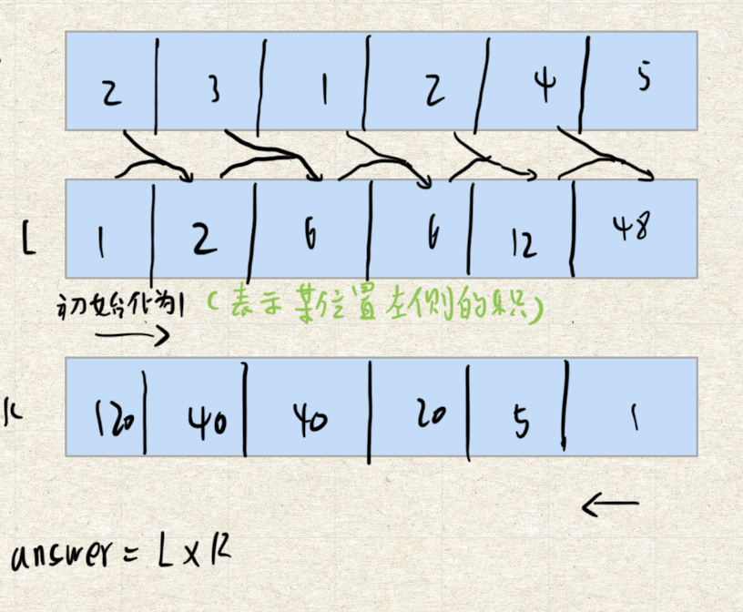

# 题目
给你一个整数数组 nums，返回 数组 answer ，其中 answer[i] 等于 nums 中除 nums[i] 之外其余各元素的乘积 。

题目数据 保证 数组 nums之中任意元素的全部前缀元素和后缀的乘积都在  32 位 整数范围内。

请不要使用除法，且在 O(n) 时间复杂度内完成此题。

# 分析


# 题解
```java
public static int[] productExceptSelf(int[] nums) {
    int length = nums.length;
    int[] R = new int[length];
    int[] L = new int[length];
    int[] answer = new int[length];
    // 某位置左侧的积
    L[0] = 1;
    for (int i = 1; i < length; i++) {
        L[i] = L[i-1] * nums[i-1];
    }
    // 某位置右侧的积
    R[length-1] = 1;
    for (int i = length - 2; i >= 0; i--) {
        R[i] = R[i+1] * nums[i+1];
    }
    // 左右侧相乘
    for (int i = 0; i < length; i++) {
        answer[i] = R[i] * L[i];
    }
    return answer;
}
```

由于多建了R,L两个数组，所以空间复杂度不为O(1)。可以减少一个，并把另外一个作为结果返回

```java
public static int[] productExceptSelf(int[] nums) {
    int length = nums.length;
    int[] L = new int[length];
    int[] answer = new int[length];
    // 某位置左侧的积
    L[0] = 1;
    for (int i = 1; i < length; i++) {
        L[i] = L[i-1] * nums[i-1];
    }
    // 再直接把右侧积加上
    int R = 1;
    for (int i = length - 2; i >= 0; i--) {
        R = R * nums[i + 1];
        L[i] *= R;
    }
    return L;
}
```